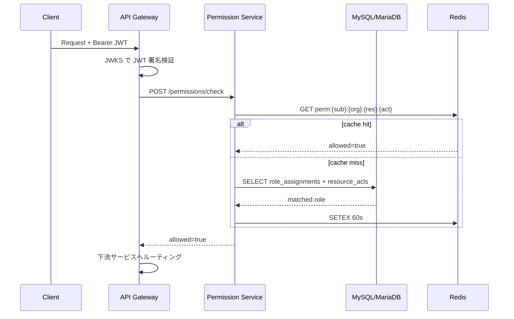

# Permission API

`recerdo-permission` が提供する認可（Authorization）・セッション・ロール管理APIです。  
認証（Authentication）は [AWS Cognito](auth.md) が担当し、本 API はその発行済み JWT を前提に **権限評価・セッション失効・ロール割当** を担います。

---

## ポリシー

AWS は **Cognito のみ** 利用する方針のため、認可判定・ロール永続化・セッション管理は Permission Service（内製）が担います。  
Beta では MySQL（MariaDB 10.11 互換） + Redis + BullMQ、本番では OCI MySQL HeatWave + OCI Queue Service + Cache with Redis を利用します。

| 領域                             | 採用プロダクト                      | 役割                                                  |
| -------------------------------- | ----------------------------------- | ----------------------------------------------------- |
| 認可評価                         | Permission Service                  | `(user_id, org_id, resource, action)` のポリシー判定  |
| セッション失効                   | Permission Service + Cognito        | BlockedTokens による即時失効・端末単位ログアウト      |
| ロール永続化                     | MySQL 8.0 / MariaDB 10.11           | `roles`, `role_assignments`, `resource_acls` テーブル |
| キャッシュ                       | Redis（BullMQ 同居）                | 評価結果を `(sub, org_id, resource, action)` でキャッシュ（TTL 60 秒） |
| 失効イベント配信                 | QueuePort（Beta: Redis+BullMQ / Prod: OCI Queue） | API Gateway / 各サービスへ変更通知                    |

---

## ベースパス

| パスプレフィックス                      | 用途                                 |
| --------------------------------------- | ------------------------------------ |
| `/api/auth/sessions/`                   | セッション・デバイス操作             |
| `/api/auth/tokens/`                     | トークン検証・無効化                 |
| `/api/auth/permissions/`                | 権限評価（check / batch check）      |
| `/api/auth/roles/`                      | ロール定義・割当（管理者向け）       |

---

## エンドポイント一覧

### セッション / トークン

| メソッド | パス                                                | 用途                                                           |
| -------- | --------------------------------------------------- | -------------------------------------------------------------- |
| `GET`    | `/api/auth/sessions`                                | 自分の全セッション一覧（デバイスごと）                         |
| `DELETE` | `/api/auth/sessions/{session_id}`                   | 指定セッションを失効（他端末ログアウト）                       |
| `DELETE` | `/api/auth/sessions`                                | 全セッションを失効（Cognito GlobalSignOut と連動）             |
| `POST`   | `/api/auth/tokens/introspect`                       | JWT 内省（`jti` ブロックリスト・`sub`・`exp` を返却）          |
| `POST`   | `/api/auth/tokens/revoke`                           | `jti` を BlockedTokens に追加                                  |

#### `POST /api/auth/tokens/introspect`

```json
// Request
{ "token": "eyJhbGciOi..." }

// Response 200
{
  "active": true,
  "sub": "a1b2c3d4-...",
  "jti": "01JXAB...",
  "exp": 1745059200,
  "scope": ["events:read", "albums:write"],
  "org_ids": ["org_01JY..."],
  "blocked": false
}
```

### 権限評価

| メソッド | パス                                     | 用途                                 |
| -------- | ---------------------------------------- | ------------------------------------ |
| `POST`   | `/api/auth/permissions/check`            | 単一 `(resource, action)` の評価     |
| `POST`   | `/api/auth/permissions/batch-check`      | 複数評価（最大 50 件）をバッチ実行   |
| `GET`    | `/api/auth/permissions/me`               | 自分に付与された全ロール・スコープ   |

#### `POST /api/auth/permissions/check`

```json
// Request
{
  "org_id": "org_01JY...",
  "resource": "event",
  "resource_id": "evt_01JY...",
  "action": "update"
}

// Response 200
{
  "allowed": true,
  "matched_role": "org_admin",
  "policy_version": 42,
  "evaluated_at": "2026-04-19T00:00:00Z"
}
```

### ロール管理（管理者）

| メソッド | パス                                                    | 用途                                       |
| -------- | ------------------------------------------------------- | ------------------------------------------ |
| `GET`    | `/api/auth/roles`                                       | ロール定義一覧                             |
| `POST`   | `/api/auth/roles`                                       | カスタムロール作成                         |
| `PUT`    | `/api/auth/roles/{role_id}`                             | ロール更新（スコープ変更）                 |
| `DELETE` | `/api/auth/roles/{role_id}`                             | ロール削除（論理削除・30日保持）           |
| `POST`   | `/api/auth/roles/{role_id}/assignments`                 | ユーザーへロール割当                       |
| `DELETE` | `/api/auth/roles/{role_id}/assignments/{assignment_id}` | ロール割当解除                             |

---

## 権限判定のフロー



---

## エラーコード

| HTTP | コード                     | 条件                                                 |
| ---- | -------------------------- | ---------------------------------------------------- |
| 401  | `TOKEN_INVALID`            | JWT 署名検証失敗・`exp` 超過                         |
| 401  | `TOKEN_BLOCKED`            | `jti` が BlockedTokens に存在                        |
| 403  | `PERMISSION_DENIED`        | ロール未付与・リソース ACL で拒否                    |
| 404  | `ROLE_NOT_FOUND`           | ロール ID が存在しない／削除済み                     |
| 409  | `ROLE_ASSIGNMENT_EXISTS`   | 同一ユーザー・同一ロールが既に割当済み               |
| 422  | `POLICY_VIOLATION`         | システム定義ロール（`org_owner` 等）は変更不可       |
| 429  | `RATE_LIMITED`             | バッチ評価が 50 件超・同一 `sub` の QPS 超過         |

---

## 変更通知（QueuePort）

ロール変更・セッション失効イベントは QueuePort 経由で配信されます。受信側（API Gateway・各サービス）はローカルキャッシュを無効化します。

| トピック                  | ペイロード                                  | トリガー                     |
| ------------------------- | ------------------------------------------- | ---------------------------- |
| `permission.role_changed` | `{user_id, org_id, role_id, policy_version}` | ロール割当・解除             |
| `permission.token_revoked`| `{jti, user_id, reason, expires_at}`        | `/tokens/revoke` または全端末ログアウト |
| `permission.user_suspended` | `{user_id, suspended_at}`                 | 人事連携・管理者操作         |

---

最終更新: 2026-04-19 ポリシー適用
