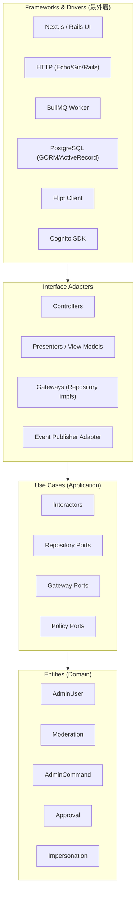

# Admin Console Service — クリーンアーキテクチャ設計

**作成者**: Claude (AI) · **作成日**: 2026-04-19 · **ステータス**: 承認待ち

> [Admin Console (MS)](../microservice/admin-console-svc.md) のドメイン境界を受けて、レイヤ別にクリーンアーキテクチャ準拠で実装するための設計書。

---

## 1. レイヤ構成

Admin Console Svc は **4 層クリーンアーキテクチャ**（Robert C. Martin）に従う。ドメインを中心に、Use Case → Interface Adapter → Frameworks の順に外側へ拡大する。



**依存方向**: 常に内側へ。Entities は外部技術（HTTP/DB/MQ）を知らない。

---

## 2. Entities（ドメイン層）

### 2.1 配置

```
internal/
  domain/
    admin/
      admin_user.go         # AdminUser entity
      admin_role.go
      admin_scope.go        # Value Object
    moderation/
      case.go               # ModerationCase entity
      decision.go           # ModerationDecision entity
      verdict.go            # Value Object
    command/
      admin_command.go      # AdminCommand aggregate root
      command_type.go       # Value Object (enum)
    approval/
      approval_request.go
      approval_policy.go    # 承認ポリシーのビジネスルール
    impersonation/
      session.go
      reason.go             # Value Object
    event/
      domain_events.go      # AdminActionExecuted 等
```

### 2.2 主要なドメインルール（Entity 内実装）

#### AdminUser

```go
type AdminUser struct {
    ID          AdminID
    Email       Email
    Role        AdminRole
    MFAEnabled  bool
    LastLoginAt *time.Time
    Status      AdminUserStatus // ACTIVE | LOCKED | DISABLED
}

// ビジネスルール: MFA 無効の管理者はログイン不可
func (u *AdminUser) CanLogin() error {
    if !u.MFAEnabled {
        return ErrMFARequired
    }
    if u.Status != AdminUserStatusActive {
        return ErrInactive
    }
    return nil
}

// スコープ判定
func (u *AdminUser) CanPerform(scope AdminScope) bool {
    return u.Role.HasScope(scope)
}
```

#### AdminCommand（集約ルート）

```go
type AdminCommand struct {
    ID          CommandID
    Type        CommandType
    Params      CommandParams
    Status      CommandStatus
    EnqueuedAt  time.Time
    Result      *CommandResult
    AuditRef    AuditID      // Audit Svc との結合子
}

// 不変条件: COMPLETED / FAILED に遷移したら Status は変更不可
func (c *AdminCommand) MarkCompleted(result CommandResult) error {
    if c.Status == CommandStatusCompleted || c.Status == CommandStatusFailed {
        return ErrTerminalStatus
    }
    c.Status = CommandStatusCompleted
    c.Result = &result
    return nil
}
```

#### ApprovalRequest

```go
type ApprovalRequest struct {
    ID             RequestID
    Action         ActionType
    RequesterID    AdminID
    ApproverID     *AdminID
    Payload        json.RawMessage
    Status         ApprovalStatus // PENDING | APPROVED | REJECTED | EXPIRED
    ExpiresAt      time.Time
}

// 承認者は申請者と同一不可（SoD: Separation of Duties）
func (r *ApprovalRequest) Approve(approver AdminID, policy ApprovalPolicy) error {
    if approver == r.RequesterID {
        return ErrSelfApprovalDenied
    }
    if time.Now().After(r.ExpiresAt) {
        return ErrExpired
    }
    if !policy.IsApproverEligible(approver, r.Action) {
        return ErrApproverUneligible
    }
    r.ApproverID = &approver
    r.Status = ApprovalStatusApproved
    return nil
}
```

---

## 3. Use Cases（アプリケーション層）

### 3.1 配置

```
internal/
  usecase/
    admin/
      search_users.go
      suspend_user.go
      restore_user.go
    moderation/
      list_cases.go
      decide_case.go
    flag/
      update_flag.go
      trigger_killswitch.go
    queue/
      view_depth.go
      redrive_dlq.go
    command/
      enqueue_command.go
      get_command_status.go
    approval/
      request_approval.go
      grant_approval.go
    impersonation/
      start_session.go
    port/                # Use Case 層のインタフェース（Repository / Gateway）
      admin_repo.go
      audit_gateway.go
      permission_gateway.go
      flag_gateway.go
      queue_gateway.go
      core_svc_gateway.go
      event_publisher.go
```

### 3.2 典型的な Interactor 実装

```go
// usecase/admin/suspend_user.go
package admin

type SuspendUserInteractor struct {
    repo        AdminRepo
    perm        PermissionGateway
    coreSvc     CoreSvcGateway
    approval    ApprovalInteractor
    audit       AuditGateway
    eventPub    EventPublisher
    flagClient  FlagClient // admin.readonly をチェック
}

type SuspendUserInput struct {
    Actor        AdminUser
    TargetUserID UserID
    Reason       string
    Duration     time.Duration
    ApprovalID   *ApprovalID // 既に承認済みなら渡す
}

func (i *SuspendUserInteractor) Execute(ctx context.Context, in SuspendUserInput) (*SuspendUserOutput, error) {
    // 1. Read-Only モード確認
    if enabled, _ := i.flagClient.Bool(ctx, "admin.readonly", false); enabled {
        return nil, ErrReadOnlyMode
    }

    // 2. 権限確認
    if !in.Actor.CanPerform(ScopeUsersSuspend) {
        return nil, ErrForbidden
    }

    // 3. 二段階承認チェック
    if in.ApprovalID == nil {
        // 承認要求を新規発行して戻す
        req, err := i.approval.Request(ctx, ActionSuspendUser, in)
        if err != nil {
            return nil, err
        }
        return &SuspendUserOutput{ApprovalRequestID: &req.ID, Status: "PENDING_APPROVAL"}, nil
    }
    if err := i.approval.VerifyApproved(ctx, *in.ApprovalID, ActionSuspendUser); err != nil {
        return nil, err
    }

    // 4. ドメイン操作（Core Svc 経由で実際に凍結）
    if err := i.coreSvc.SuspendUser(ctx, in.TargetUserID, in.Reason, in.Duration); err != nil {
        return nil, err
    }

    // 5. 監査記録（同期、失敗したら全体失敗）
    action := NewAdminAction(in.Actor.ID, ActionSuspendUser, in.TargetUserID, in)
    if err := i.audit.Write(ctx, action); err != nil {
        // コア側をロールバック
        _ = i.coreSvc.RestoreUser(ctx, in.TargetUserID, "audit-failure-rollback")
        return nil, ErrAuditWriteFailed
    }

    // 6. ドメインイベント発行
    i.eventPub.Publish(ctx, AdminActionExecutedEvent{
        ActorID: in.Actor.ID, Type: ActionSuspendUser, Target: in.TargetUserID,
    })

    return &SuspendUserOutput{Status: "SUSPENDED"}, nil
}
```

### 3.3 Use Case 層の設計ポリシー

- **Interactor は 1 ユースケース 1 構造体**（Single Responsibility）
- **入出力はプレーンな構造体**（HTTP / GraphQL / CLI いずれからも呼べる）
- 失敗時の**補償トランザクション**を Interactor 内に明示記述
- **外部依存はすべて Port**（具象は外側が注入）

---

## 4. Interface Adapters（インタフェース層）

### 4.1 配置

```
internal/
  adapter/
    controller/
      http/                # Next.js / Rails からの HTTP リクエスト
        admin_user_ctrl.go
        moderation_ctrl.go
        flag_ctrl.go
        command_ctrl.go
      grpc/                # 将来: 内部サービス間 gRPC
    presenter/
      json_presenter.go
      csv_presenter.go     # エクスポート用
    gateway/
      admin_repo_pg.go     # PostgreSQL 実装
      audit_http_gateway.go
      permission_http_gateway.go
      flag_flipt_gateway.go
      queue_bullmq_gateway.go
      queue_ociqueue_gateway.go
      core_svc_http_gateway.go
    event/
      event_bullmq_pub.go  # ドメインイベントを BullMQ へ
```

### 4.2 Gateway の責務

- ドメイン型 ↔ 外部 DTO の変換
- 外部技術固有のエラーをドメインエラーに変換
- リトライ・サーキットブレーカー

```go
// adapter/gateway/flag_flipt_gateway.go
type FliptFlagGateway struct {
    client flipt.Client
    cb     circuit.Breaker
}

func (g *FliptFlagGateway) UpdateFlag(ctx context.Context, key string, change FlagChange) error {
    err := g.cb.Execute(func() error {
        return g.client.UpdateFlag(ctx, toFliptReq(key, change))
    })
    if errors.Is(err, flipt.ErrNotFound) {
        return domain.ErrFlagNotFound
    }
    return err
}
```

### 4.3 Controller の責務

- 入力のバインディング・バリデーション
- 認証（JWT 検証）・アクター（AdminUser）の構築
- Interactor 呼び出し
- Presenter でレスポンス整形

### 4.4 Presenter の責務

- ドメイン型 → View Model（JSON / CSV / HTML）
- **ドメイン型を直接シリアライズしない**（永続化キー・内部 ID の漏洩防止）

---

## 5. Frameworks & Drivers（最外層）

### 5.1 構成要素

| 要素 | 採用技術 | 役割 |
|---|---|---|
| Web Framework | Next.js 15 / Rails 8（並行） | UI・ルーティング |
| HTTP Server | Echo or Gin（API のみバックエンド） | RESTful API |
| ORM | GORM（Go）or ActiveRecord（Rails） | RDBMS アクセス |
| Queue Client | BullMQ / OCI Queue SDK | 非同期ジョブ |
| Auth SDK | Cognito SDK | JWT 検証 |
| Flag Client | Flipt SDK / OpenFeature | Feature Flag |
| Observability | OpenTelemetry + Prometheus | メトリクス・トレース |

### 5.2 エントリポイント

```go
// cmd/admin-console/main.go
func main() {
    cfg := config.Load()
    ff := openfeature.New(cfg.FlagProvider)

    // アダプタ注入 — Beta/本番で差し替わる唯一の箇所
    queueGateway := buildQueueGateway(cfg, ff)           // BullMQ or OCI Queue
    storageGateway := buildStorageGateway(cfg)           // MinIO or OCI OSS
    repo := buildAdminRepo(cfg)

    // Interactor 構築
    suspendUC := usecase.NewSuspendUser(repo, permGW, coreGW, approvalUC, auditGW, eventPub, ff)
    // ... 他のユースケース

    // Controller 配線
    router := http.NewRouter(suspendUC, ...)
    server := http.NewServer(cfg.Addr, router)
    server.Run()
}
```

### 5.3 Rails 版（Admin UI のみ、バックエンドは上記 Go サーバに委譲）

```ruby
# app/controllers/admin/users_controller.rb (Rails)
class Admin::UsersController < AdminController
  def suspend
    result = AdminApi::SuspendUser.call(
      actor: current_admin, user_id: params[:id],
      reason: params[:reason], duration_days: params[:duration_days]
    )
    respond_to_result result
  end
end

# app/services/admin_api/suspend_user.rb
module AdminApi
  class SuspendUser
    def self.call(actor:, user_id:, reason:, duration_days:)
      # Go バックエンドの /admin/v1/users/:id/suspend を呼び出す
      HTTP.auth_admin(actor).post("/admin/v1/users/#{user_id}/suspend", json: {...})
    end
  end
end
```

!!! note "Rails × Go のハイブリッドが成立する理由"
    クリーンアーキテクチャでは "UI は最外層" に位置し、**同じ Use Case に対して複数の UI 実装** が並立可能。Rails 版は Controller + Presenter レイヤのみを Rails 側に作り、Entities / Use Cases は Go サーバで単一実装する。

---

## 6. テスト戦略（レイヤ別）

| レイヤ | テスト種別 | カバレッジ目標 |
|---|---|---|
| Entities | 純粋ユニットテスト（依存ゼロ） | 95% |
| Use Cases | Mock Port での Interactor テスト | 90% |
| Adapters | Docker Compose での統合テスト | 70% |
| Frameworks | E2E（Cypress / Playwright） | 主要フロー 100% |

### 6.1 Entity テスト例

```go
func TestApprovalRequest_SelfApprovalDenied(t *testing.T) {
    req := NewApprovalRequest(adminA, ActionSuspendUser, payload)
    err := req.Approve(adminA, policy) // 自己承認
    require.ErrorIs(t, err, ErrSelfApprovalDenied)
}
```

### 6.2 Use Case テスト例

```go
func TestSuspendUser_ReadOnlyMode(t *testing.T) {
    ff := fakeFlagClient{bools: map[string]bool{"admin.readonly": true}}
    uc := NewSuspendUserInteractor(..., ff)
    _, err := uc.Execute(ctx, SuspendUserInput{Actor: adminA, ...})
    require.ErrorIs(t, err, ErrReadOnlyMode)
}
```

### 6.3 契約テスト

- Queue / Flag / Audit の Gateway は **契約テスト**（3.x 参照）を提供し、どの具象実装でも Use Case が同一動作することを保証

---

## 7. トランザクション境界

クリーンアーキテクチャにおけるトランザクション管理の原則：

1. **Use Case 層がトランザクション境界を定義**（ドメイン層は関与しない）
2. Use Case は `UnitOfWork` Port を注入される
3. Adapter 層が DB/外部リソースを開始・コミット・ロールバック

```go
type UnitOfWork interface {
    WithTx(ctx context.Context, fn func(tx Tx) error) error
}

// Use Case 内
return i.uow.WithTx(ctx, func(tx Tx) error {
    if err := i.repo.WithTx(tx).Save(cmd); err != nil { return err }
    if err := i.audit.WithTx(tx).Write(act); err != nil { return err }
    return nil
})
```

**外部システム（Cognito/Cognito/Core Svc）は分散トランザクション不可**のため、**補償パターン**（Saga）で対処。

---

## 8. 実装ディレクトリ総覧

```
admin-console-svc/
├── cmd/
│   └── admin-console/main.go
├── internal/
│   ├── domain/              # Entities
│   │   ├── admin/
│   │   ├── moderation/
│   │   ├── command/
│   │   ├── approval/
│   │   ├── impersonation/
│   │   └── event/
│   ├── usecase/             # Use Cases + Ports
│   │   ├── admin/
│   │   ├── moderation/
│   │   ├── flag/
│   │   ├── queue/
│   │   ├── command/
│   │   ├── approval/
│   │   ├── impersonation/
│   │   └── port/
│   └── adapter/             # Interface Adapters
│       ├── controller/
│       ├── presenter/
│       ├── gateway/
│       └── event/
├── pkg/                     # 再利用可能な共通コード
│   ├── openapi/
│   └── logging/
├── web/                     # Frontend (Next.js 版)
│   └── admin-console-ui/
├── rails_admin/             # Rails 版 UI（独立プロジェクト）
├── test/
│   ├── contract/            # 契約テスト
│   └── e2e/
├── deploy/
│   ├── docker-compose.yml   # Beta 用
│   └── helm/                # 本番 (OCI k8s) 用
└── docs/
    └── openapi.yaml
```

---

## 9. 実装チェックリスト

- [ ] Entities 層にフレームワーク依存が混入していない
- [ ] Use Case がすべて Port 経由で外部と通信している
- [ ] Gateway はドメインエラーに変換してから返している
- [ ] Controller / Presenter が薄く保たれている（ビジネスロジックを持たない）
- [ ] すべての Write 操作が Audit Svc 書き込みで囲まれている
- [ ] `admin.readonly` フラグが全 Write UseCase 冒頭でチェックされている
- [ ] 自己承認防止・期限切れ承認の拒否がテストで担保されている
- [ ] アダプタ差し替えが環境変数 + Feature Flag のみで可能
- [ ] BullMQ / OCI Queue 両方で契約テスト PASS

---

## 10. 関連ドキュメント

- [Admin Console Svc（MS）](../microservice/admin-console-svc.md)
- [Feature Flag System（CA）](feature-flag-system.md)
- [Permission Service（旧構成）](auth-svc.md)（Permission 独立後は差し替え）
- [Audit Service（CA）](audit-svc.md)
