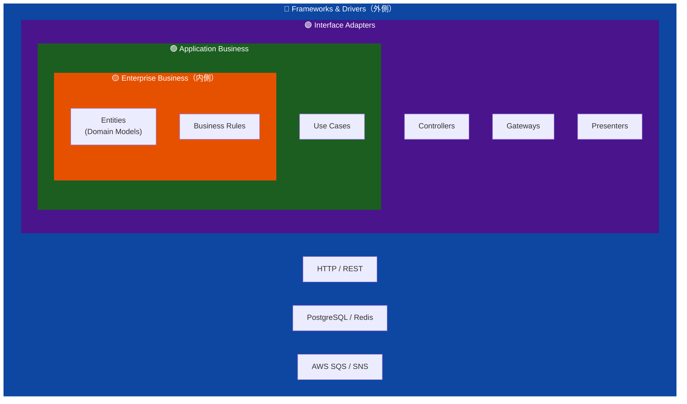

# クリーンアーキテクチャ設計

Recerdoの各サービスはクリーンアーキテクチャ（Clean Architecture）に基づいて設計されています。  
Uncle Bobが提唱するレイヤー分離の原則に従い、ビジネスロジックを外部依存から完全に分離します。

## アーキテクチャ原則

## 依存性の方向

**外側 → 内側** への一方向のみ。内側のレイヤーは外側のレイヤーを知らない。

- `Entities` — ドメインモデル、ビジネスルール（外部依存ゼロ）
- `Use Cases` — アプリケーション固有のビジネスロジック
- `Interface Adapters` — Controllers / Repositories（インターフェース実装）
- `Frameworks & Drivers` — DB / HTTP / Message Queue（具体実装）

## 設計書一覧

| サービス | 設計書 | セクション数 |
|---------|-------|------------|
| [API Gateway](api-gateway.md) | recuerdo-api-gateway | 14 |
| [Authentication Service](auth-svc.md) | recuerdo-auth-svc | 14 |
| [Audit Service](audit-svc.md) | recuerdo-audit-svc | 14 |
| [Album Service](album-svc.md) | recuerdo-album-svc | 14 |
| [Events Service](events-svc.md) | recuerdo-events-svc | 14 |
| [Timeline Service](timeline-svc.md) | recuerdo-timeline-svc | 14 |
| [Storage Service](storage-svc.md) | recuerdo-storage-svc | 14 |

## 設計書の構成（14セクション）

各設計書は以下の共通構成に従っています：

1. 概要・目的・アーキテクチャ原則
2. レイヤーアーキテクチャ（図）
3. エンティティ層（ドメインモデル）
4. ユースケース層
5. インターフェースアダプター層
6. フレームワーク・ドライバー層
7. 依存性注入（DI）設計
8. データベース設計
9. API設計
10. エラーハンドリング
11. テスト戦略
12. 非機能要件
13. デプロイ・インフラ
14. 変更履歴・レビュー記録
