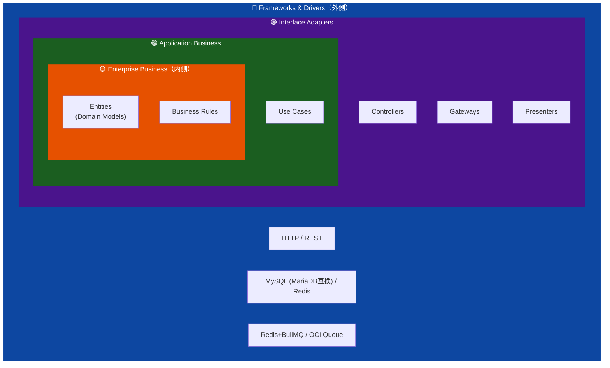
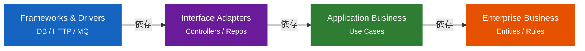

# クリーンアーキテクチャ設計

Recerdoの各サービスはクリーンアーキテクチャ（Clean Architecture）に基づいて設計されています。  
Uncle Bobが提唱するレイヤー分離の原則に従い、ビジネスロジックを外部依存から完全に分離します。

## アーキテクチャ原則

## 依存性の方向

**外側 → 内側** への一方向のみ。内側のレイヤーは外側のレイヤーを知らない。

- `Entities` — ドメインモデル、ビジネスルール（外部依存ゼロ）
- `Use Cases` — アプリケーション固有のビジネスロジック
- `Interface Adapters` — Controllers / Repositories（インターフェース実装）
- `Frameworks & Drivers` — DB / HTTP / Message Queue（具体実装）

## 設計書一覧

| サービス                                      | 設計書                     | セクション数 |
| --------------------------------------------- | -------------------------- | ------------ |
| [API Gateway](api-gateway.md)                 | recuerdo-api-gateway       | 14           |
| [Authentication Service](auth-svc.md)         | recuerdo-auth-svc          | 14           |
| [Audit Service](audit-svc.md)                 | recuerdo-audit-svc         | 14           |
| [Album Service](album-svc.md)                 | recuerdo-album-svc         | 14           |
| [Events Service](events-svc.md)               | recuerdo-events-svc        | 14           |
| [Timeline Service](timeline-svc.md)           | recuerdo-timeline-svc      | 14           |
| [Storage Service](storage-svc.md)             | recuerdo-storage-svc       | 14           |
| [Notification Service](notifications-svc.md)  | recuerdo-notifications-svc | 14           |
| [Feature Flag System](feature-flag-system.md) | recuerdo-feature-flag-svc  | 14           |
| [Admin Console Service](admin-console-svc.md) | recuerdo-admin-console-svc | 10           |

## 設計書の構成（14セクション）

各設計書は以下の共通構成に従っています：

1. 概要・目的・アーキテクチャ原則
2. レイヤーアーキテクチャ（図）
3. エンティティ層（ドメインモデル）
4. ユースケース層
5. インターフェースアダプター層
6. フレームワーク・ドライバー層
7. 依存性注入（DI）設計
8. データベース設計
9. API設計
10. エラーハンドリング
11. テスト戦略
12. 非機能要件
13. デプロイ・インフラ
14. 変更履歴・レビュー記録

## インフラ方針サマリ（Beta / Prod）

Recerdo は環境ごとに**ポート & アダプタ**を差し替えるヘキサゴナル設計に従う。
AWS の利用は **Cognito のみ**（SES/SQS/SNS/S3/DynamoDB/RDS/EC2/EKS/ElastiCache/Lambda/CloudFront 等は利用しない）。

| レイヤ          | Port                  | Beta アダプタ (XServer VPS / CoreServerV2)      | Prod アダプタ (OCI-first)             |
| --------------- | --------------------- | ----------------------------------------------- | ------------------------------------- |
| Object Storage  | `StoragePort`         | `GarageStorageAdapter`（Garage OSS, S3互換API） | `OCIObjectStorageAdapter`             |
| RDBMS           | `Repository`          | MySQL 8.x / MariaDB 互換                        | OCI MySQL HeatWave（MariaDB 互換SQL） |
| Queue / Job     | `QueuePort`           | `RedisBullMQAdapter` / `AsynqAdapter`           | `OCIQueueAdapter`                     |
| Cache           | `CachePort`           | Redis (self-hosted)                             | OCI Cache with Redis                  |
| Mail (SMTP)     | `MailPort`            | `PostfixSMTPAdapter`（Postfix+Dovecot+Rspamd）  | `PostfixSMTPAdapter`（CoreServerV2）  |
| Media Transcode | `MediaTranscoderPort` | `FFmpegHLSAdapter` / `LibheifImageAdapter`      | 同左（OCI Compute 上で稼働）          |
| Push            | `PushPort`            | `FCMPushAdapter`                                | `FCMPushAdapter`                      |
| Auth (JWT)      | `AuthPort`            | `CognitoAuthAdapter`                            | `CognitoAuthAdapter`                  |
| Feature Flag    | `FlagPort`            | Flipt (self-hosted) + OpenFeature SDK           | Flipt + OpenFeature SDK               |

メディアは全環境共通で、**動画は自動 HLS（360p / 720p / 1080p、6 秒セグメント）**、
**HEIC は libheif で JPEG/WebP に変換**、**Live Photo は `asset_identifier` でペアリング**。
ハイライトビデオは**ユーザー指定の素材のみ**を結合し、**自動生成や ML による推薦は行わない**。

## 追加設計プラン反映（設計・分析・考察の反復）

| 設計観点 | 参照モデル | Recuerdo クリーンアーキテクチャでの反映 |
| --- | --- | --- |
| 通知チャネル戦略 | 大規模 SNS の Push-first モデル | Notification UseCase で Push-first / Email-conditional を明文化 |
| 障害復旧戦略 | 大規模イベント基盤の DLQ 運用 | QueuePort + Retry + DLQ を全サービス共通の Port 契約として再確認 |
| セキュリティレビュー | SMTP/TLS 運用ベストプラクティス | MailPort 実装例を STARTTLS 必須・非対応時失敗に統一 |
| 変更容易性 | 契約固定・実装差し替えモデル | Port 契約を固定し、Beta/Prod の差分を Adapter に限定 |

### 課題・他者レビューを踏まえた更新方針

- ドキュメント内のコード例は「動く例」より「安全要件を満たす例」を優先する。
- レビューで発見された横断課題は、単一ページ修正で終わらせず index と policy に再反映する。
- Clean Architecture の責務境界（UseCase/Port/Adapter）と運用要件（監査・再試行）を同時に記述する。

## 横断パターン { #横断パターン }

[基本的方針（Policy）§8](../core/policy.md#8-大規模類似サービス参照反復版) で定義した横断標準は、クリーンアーキテクチャ上で以下の層に落とし込む。

| パターン                        | 該当レイヤ                                                      | 実装上の責務                                                                                                                                                              |
| ------------------------------- | --------------------------------------------------------------- | ------------------------------------------------------------------------------------------------------------------------------------------------------------------------- |
| **Idempotency Key**             | Interface Adapters（Controller）+ Framework（Redis キャッシュ） | Controller が `Idempotency-Key` ヘッダを読み、`IdempotencyStore` Port（Redis 実装）に問合せてヒット時はキャッシュ応答を返す。UseCase は冪等性を意識しない。               |
| **Transactional Outbox**        | UseCase + Framework（DB）                                       | UseCase が `EventPublisherPort.Publish(event)` を呼び、Adapter 実装が **同一トランザクション内で `outbox_events` に INSERT**。別プロセスのポーラが QueuePort に転送する。 |
| **Saga (Choreography)**         | UseCase（各サービス）                                           | 受信 QueueEvent → UseCase → Outbox に次イベントを書く／補償イベントを書く。中央オーケストレータは置かない。                                                               |
| **Circuit Breaker**             | Interface Adapters（外部サービス Adapter）                      | Adapter が `gobreaker.CircuitBreaker` をラップし、Open 時は `ErrCircuitOpen` を返す。UseCase は Port 越しに通常のエラーとして扱う。                                       |
| **OpenTelemetry**               | Framework + Interface Adapters                                  | `context.Context` にスパンを流し、Port 境界でスパンを作成。ドメイン／UseCase 層は OTel SDK に直接依存しない。                                                             |
| **SLI/SLO 計測**                | Framework（middleware）                                         | HTTP ミドルウェア / QueuePort Consumer ラッパでメトリクスを Prometheus Exporter に emit。                                                                                 |
| **レート制限**                  | Interface Adapters（Gateway / Middleware）                      | Controller 前段のミドルウェアで Token Bucket（Redis Lua）を評価。`RateLimitPort` として抽象化する。                                                                       |
| **Content-Addressable Storage** | UseCase + Infra（storage-svc のみ）                             | UseCase が SHA-256 を算出し、`MediaBlobRepository.FindBySHA256` → ヒット時は参照カウントのみ増加、未ヒット時のみ `StoragePort.PutObject`。                                |
| **SMTP 最低要件**               | Infra Adapter（`PostfixSMTPAdapter`）                           | STARTTLS 広告確認 → TLS 1.2+ 昇格 → AUTH 拡張確認後にのみ `PlainAuth` 実行。未広告時は **エラーを返して失敗**する（平文 AUTH / 平文配送を禁止）。                         |

### 反映のための設計原則

1. **横断標準は Port のインタフェース定義として残す**。UseCase / Entity は実装詳細を知らない。
2. **Adapter 層で横断標準の実装を提供**。Beta / Prod の差異は Adapter 切替で吸収する。
3. **Framework 層のラッパでメトリクス・トレース・リトライを注入**。UseCase のコードを汚さない。
4. **失敗時の責務は UseCase が明示**。`*Failed` ドメインイベントと補償処理は UseCase に記述する。

---

### 14. 変更履歴・レビュー記録（追加設計プラン反映）

各設計書は §14 に以下を追記する運用にする。

- **反映したレビュー指摘**（PR #、コミットハッシュ、指摘概要）
- **採用した横断標準**（本 index の表のどれを適用したか）
- **残課題・今後のレビュー観点**

レビュー反復の履歴は [基本的方針（Policy）§8.11](../core/policy.md#8-大規模類似サービス参照反復版) とも整合させる。

---

最終更新: 2026-04-19 ポリシー適用（追加設計プラン反映）

