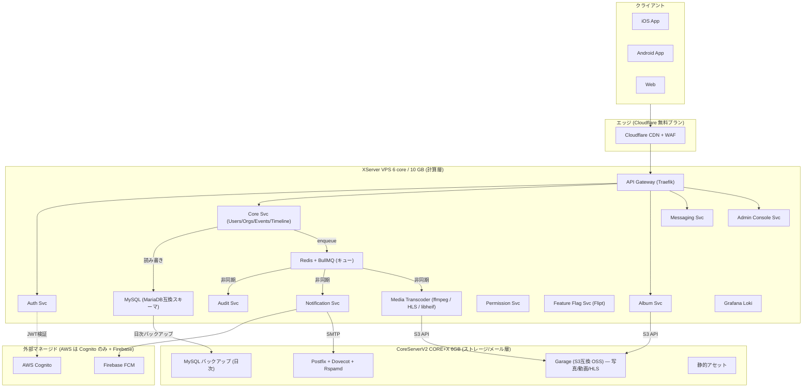
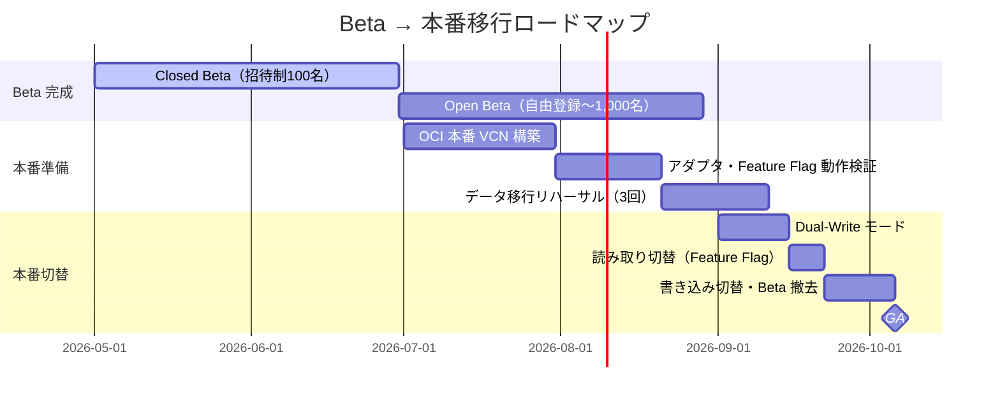

# デプロイメント戦略 — Beta → 本番マルチクラウド移行

> **対象フェーズ**: Closed Beta 〜 GA（General Availability）
> **作成日**: 2026-04-19
> **最終更新**: 2026-04-19
> **ステータス**: 承認待ち
> **関連コメント**: Notion Design Docs（2026-04-18）「SQSを採用するようにしているが、Oracleや自前のバッジ処理などで利用する場合などを複数検討した上でシステムを提案するように」

!!! note "ポリシー準拠"
    本ドキュメントは最新インフラポリシーに準拠して全面更新されています。Beta は **XServer VPS (6 core / 10 GB) + CoreServerV2 CORE+X** による OSS セルフホスト、本番は **OCI ファースト**。AWS 利用は **Cognito のみ** に限定、オブジェクトストレージは Beta=**Garage (S3互換 OSS)**／本番=**OCI Object Storage**、メールは両フェーズとも CoreServerV2 上で自前 Postfix+Dovecot+Rspamd 運用。

---

## 1. エグゼクティブサマリー

Recerdo は **Viejoアプリ**（旧友・仲良かったグループとのSocialMedia）として、大手SNSと異なり "限定クローズド" なトラフィック特性を持つ。この特性を最大限活かすため、以下の二段階デプロイ戦略を採る。

| フェーズ                 | 基盤                                                                                                                           | 目的                                | 月額コスト目標  |
| ------------------------ | ------------------------------------------------------------------------------------------------------------------------------ | ----------------------------------- | --------------- |
| **Closed Beta**          | セルフホスト: **XServer VPS (6 core / 10 GB)** + **CoreServerV2 CORE+X (6 GB)**（全て OSS）                                    | 低コスト運用、1,000MAU以内          | 約 ¥6,000/月    |
| **Open Beta → 初期本番** | **OCI ファースト**（Oracle Cloud Infrastructure 東京/大阪）+ AWS Cognito（認証のみ）+ CoreServerV2 メールサーバー継続          | 安価クラウドで10,000MAUまでスケール | ¥10,000〜30,000 |
| **GA（成熟）**           | OCI を主、AWS は **Cognito 限定**、メールは引き続き CoreServerV2 上の Postfix+Dovecot+Rspamd                                   | 50,000MAU超に対応                   | ¥30,000〜       |

**設計原則**: コードベースは **単一** を維持し、クラウド事業者・ミドルウェア実装は **ハードコードせず**、**Feature Flag + 環境変数（12-factor config）+ アダプタパターン（Hexagonal Architecture）** で差し替え可能にする。これにより、Beta → 本番切替時に「リポジトリを書き換える」のではなく「環境変数とフラグを切り替える」だけで移行できる。

### Beta 段階の実装配置方針
- 設計上は per-service 分離を維持しつつ、Beta 段階では統合運用を許容する。
- 本番昇格前にサービス分割前提の運用手順（CI/CD・監視・ロールバック）へ段階移行する。

---

## 2. Notion レビューコメント対応マトリクス

| コメント内容                                                                  | 本設計書での対応                                                                     | 関連セクション                                                                                                               |
| ----------------------------------------------------------------------------- | ------------------------------------------------------------------------------------ | ---------------------------------------------------------------------------------------------------------------------------- |
| SQS採用を全体で決めているが、代替（Oracle・自前バッジ処理）を複数検討せよ     | **AWS SQS は採用しない**。Beta は Redis+BullMQ／本番は OCI Queue Service（AMQP 1.0） | §5, [キュー抽象化設計](../microservice/queue-abstraction.md)                                                                 |
| AWSを基本としつつ Oracle Cloud など安価クラウドを利用                         | **OCI ファースト戦略**、AWS は **Cognito のみ** 限定利用                             | §3                                                                                                                           |
| Beta版はセルフホスト（VPS + レンタルサーバー）                                | XServer VPS（計算）＋ CoreServerV2 CORE+X（Garage/メール/静的/バックアップ）の分離   | §4                                                                                                                           |
| Beta→本番でシステム改修が大変にならないように、Feature Flag・ソフト変更で対応 | 環境抽象化レイヤ＋Feature Flag駆動切替                                               | §6, [環境抽象化](environment-abstraction.md)                                                                                 |
| 管理者コンソール設計がない。マイクロサービス・クリーンアーキベースで検討      | 独立マイクロサービスとして追加                                                       | [Admin Console (MS)](../microservice/admin-console-svc.md)・[Admin Console (CA)](../clean-architecture/admin-console-svc.md) |

---

## 3. クラウド選定理由と制約

### 3.1 OCI ファースト戦略の根拠

- **コスト優位性**: OCI の標準コンピュートは AWS EC2 比で **約57%安価**、ブロックストレージで **約78%安価**、外向きデータ転送で **約13倍安価**（AWS: 100GB/月 vs OCI: 10TB/月の常時無料枠）
- **S3 互換オブジェクトストレージ**: OCI Object Storage は **Amazon S3 互換 API** を提供し、Garage と同じクライアントコードで切替可能
- **MySQL HeatWave / MySQL Database Service**: フルマネージド MySQL。ただし **MariaDB 互換性を保つ** ため、MySQL 独自機能（例: 8.0 の JSON_TABLE、CHECK 制約の差、空間データ関数の差）は使用しない。ウィンドウ関数は MariaDB 10.6+ でも利用可のため OK。参考: [MariaDB vs MySQL Compatibility](https://mariadb.com/docs/release-notes/community-server/about/compatibility-and-differences/mariadb-vs-mysql-compatibility)
- **日本リージョン**: 東京（ap-tokyo-1）・大阪（ap-osaka-1）を両方提供、リージョン間DRが組める
- **除外クラウド**: 中国系パブリッククラウド（Alibaba Cloud / Tencent Cloud）、および日本リージョンを持たない一部ヨーロッパ系クラウドは **データ主権要件・レイテンシー要件** から除外

### 3.2 AWS 併用範囲（Cognito のみ）+ FCM

OCI ファーストとしつつも、以下の領域のみ **AWS / Firebase を維持** する：

| サービス                         | 用途                                                                                |
| -------------------------------- | ----------------------------------------------------------------------------------- |
| **AWS Cognito**（認証）          | 50,000 MAU 無料枠、Hosted UI 対応、OIDC/SAML 完備、ユーザープールの移行コストが高い |
| **Firebase FCM**（プッシュ通知） | 完全無料・無制限、Android/iOS両対応                                                 |

!!! danger "AWS 利用範囲の厳格な制限"
    Recerdo における AWS 利用は **Cognito のみ**。以下は一切採用しない：
    - AWS **SES / SNS / SQS / DynamoDB / RDS / EC2 / EKS / ElastiCache / Lambda / CloudFront / S3**
    - メールは **自前 Postfix+Dovecot+Rspamd**（CoreServerV2 CORE+X）
    - キューは Beta=Redis+BullMQ、本番=OCI Queue Service（AMQP 1.0）
    - オブジェクトストレージは Beta=Garage、本番=OCI Object Storage

!!! tip "メールサーバーの方針"
    Beta／本番とも **CoreServerV2 CORE+X 上で Postfix + Dovecot + Rspamd** を自前運用する。SPF / DKIM / DMARC を全て設定し、IP warm-up（ウォーミング）を計画的に実施する。参考: [I built my own mail server: Postfix, Dovecot, Rspamd — the calm path to deliverability](https://www.dchost.com/blog/en/i-built-my-own-mail-server-postfix-dovecot-rspamd-and-the-calm-path-to-deliverability-with-ip-warm%E2%80%91up/)

### 3.3 除外候補と根拠

| クラウド                     | 除外理由                                                               |
| ---------------------------- | ---------------------------------------------------------------------- |
| GCP                          | コスト面で OCI に劣る、日本法人サポート体制が限定的                    |
| Azure                        | エンタープライズ向けで個人開発に割高、Cognito 互換性弱い               |
| Alibaba Cloud                | データ主権・法規制リスク                                               |
| 国内IaaS（さくらクラウド等） | OCI と同等価格帯だが、グローバル拡張パスが弱い（将来の海外展開を考慮） |

---

## 4. Beta フェーズ物理構成（セルフホスト）

### 4.1 物理配置の原則

Closed Beta では "VPS（計算）" と "レンタルサーバー（ストレージ/メール）" を **物理的に分離** する。

- **計算層**: XServer VPS（6 core / 10 GB RAM） — 全マイクロサービスを Docker Compose で稼働（Beta は単一ノードのため軽量運用）。本番は OCI Container Instances または OKE（OCI Kubernetes Engine）
- **ストレージ/メール層**: CoreServerV2 CORE+X（6 GB ストレージ） — Garage（S3互換 OSS）、Postfix+Dovecot+Rspamd、静的アセット、バックアップ

### 4.2 VPS（計算層）: XServer VPS 6 core / 10 GB

**内容**:
- 全マイクロサービスを Docker Compose（Beta は単一ノードのため軽量運用）で稼働。本番は OCI Container Instances または OKE（OCI Kubernetes Engine）
- Traefik をリバースプロキシ・API Gateway として使用（Let's Encrypt 自動化）
- **MySQL** は VPS 内で稼働。**ただしスキーマ・クエリは MariaDB 互換に保つ**（JSON_TABLE 等 MySQL 独自機能の不使用、ウィンドウ関数は MariaDB 10.6+ でも可）
- **Redis + BullMQ / asynq** をキューとして利用（OSS、セルフホスト）
- **Grafana Loki** でログ集約
- **Flipt** で Feature Flag 管理
- **メディア変換ワーカー（ffmpeg / libheif / go-libheif）** を別コンテナで起動。HLS 変換は CPU 負荷が高いため、CPU 上限設定を行い、必要に応じて第二 VPS へオフロードする（[server-capacity-planning.md](server-capacity-planning.md) §3 参照）

### 4.3 レンタルサーバー（ストレージ/メール層）: CoreServerV2 CORE+X

**内容**:
- **Garage（S3互換オブジェクトストレージ OSS）** を設置し、Album Service・Media Transcoder のバックエンドとする。Garage は分散 S3 互換ストレージで、少数ノード・地理分散・Geo-redundancy に最適化されている。参考: [Garage Documentation](https://garagehq.deuxfleurs.fr/documentation/)
- **Postfix + Dovecot + Rspamd** を自前構築し、トランザクションメール（通知・招待・パスワードリセット）を送信。SPF / DKIM / DMARC を設定、送信 IP を段階的に warm-up
- MySQL 日次バックアップ保管（gzip + gpg 暗号化）
- 静的アセット（アプリ内画像・LP）のホスティング

!!! note "CoreServerV2 上での Garage"
    CoreServerV2 CORE+X は共用環境であり、Garage バイナリを直接起動できない場合はフォールバックとして **VPS 内に Garage を設置し、CoreServerV2 は rsync / SFTP 経由の冷蔵バックアップ専用** に切り替える（§4.4 参照）。

### 4.4 フォールバック構成（CoreServerV2 で Garage 起動不可の場合）

| 層                     | 代替案                                                                                           |
| ---------------------- | ------------------------------------------------------------------------------------------------ |
| オブジェクトストレージ | **XServer VPS 内に Garage を同居**（CPU/メモリ負荷を監視）+ CoreServerV2 は SFTP の低頻度バックアップ |
| バックアップ先         | OCI Object Storage の Standard tier に移すか、CoreServerV2 上に SFTP で保管                      |

---

## 5. 本番移行時のクラウドマッピング

### 5.1 コンポーネントごとの Beta → 本番マッピング

| コンポーネント         | Beta（セルフホスト）                                  | 本番（OCI ファースト）                                                 | 切替手段                                 |
| ---------------------- | ----------------------------------------------------- | ---------------------------------------------------------------------- | ---------------------------------------- |
| API Gateway            | Traefik on XServer VPS                                | **OCI Load Balancer + API Gateway**（または Traefik 継続）             | 環境変数 `API_GATEWAY_URL`               |
| 認証                   | AWS Cognito（Beta から継続）                          | AWS Cognito（継続）                                                    | 変更なし                                 |
| データベース           | MySQL on XServer VPS（MariaDB 互換スキーマ）          | **OCI MySQL HeatWave / MySQL Database Service**（MariaDB 互換スキーマ維持） | 接続文字列 `DATABASE_URL`                |
| キャッシュ             | Redis on XServer VPS（OSS）                           | **OCI Cache with Redis**                                               | `REDIS_URL`                              |
| メッセージキュー       | **Redis + BullMQ / asynq**（セルフホスト、OSS）       | **OCI Queue Service（AMQP 1.0）**                                      | Feature Flag `infra.queue.provider` + アダプタ |
| オブジェクトストレージ | **Garage on CoreServerV2 CORE+X**（S3互換 OSS）       | **OCI Object Storage**（S3互換）                                       | `STORAGE_PROVIDER` + `STORAGE_ENDPOINT`  |
| メディア変換           | ffmpeg (HLS) + libheif on XServer VPS                 | ffmpeg (HLS) + libheif on OCI Compute (VM.Standard.A1.Flex 等)         | `MEDIA_TRANSCODER=ffmpeg-hls` 継続       |
| メール                 | **Postfix+Dovecot+Rspamd on CoreServerV2 CORE+X**     | **Postfix+Dovecot+Rspamd on CoreServerV2 CORE+X を継続**               | `MAIL_PROVIDER=postfix-smtp`（変更なし） |
| プッシュ通知           | Firebase FCM                                          | Firebase FCM（継続）                                                   | 変更なし                                 |
| Feature Flag基盤       | Flipt（セルフホスト、OSS）                            | Flipt（継続、OCI VPS 上で稼働）                                        | 変更なし                                 |
| 監査ログ保管           | MySQL + Garage 冷蔵                                   | OCI Object Storage + **Archive tier**                                  | `AUDIT_ARCHIVE_BUCKET`                   |
| ログ集約               | Grafana Loki（OSS、セルフホスト）                     | OCI Logging（または Loki 継続）                                        | Feature Flag `observability.stack`       |
| CDN                    | Cloudflare 無料                                       | Cloudflare 無料継続（必要なら Pro へ）+ OCI Object Storage オリジン    | `CDN_BASE_URL`                           |

### 5.2 切替単位：リポジトリ不変／環境変数可変

| 変更タイプ               | 具体例                                                                           | Beta→本番でやること                  |
| ------------------------ | -------------------------------------------------------------------------------- | ------------------------------------ |
| **ハードコード禁止項目** | `queueProvider = "redis"`、`s3Endpoint = "https://garage.local"`                 | ❌ コード内に直接書かない             |
| **環境変数で差し替え**   | `QUEUE_PROVIDER=redis-bullmq` → `QUEUE_PROVIDER=oci-queue`                       | `.env.production` を書き換えるだけ   |
| **Feature Flag で切替**  | `infra.queue.provider` を `oci-queue` に Percentage Rollout                      | Flipt ダッシュボードで ON にするだけ |
| **アダプタ実装で吸収**   | `QueuePort` 配下に `RedisBullMQAdapter` / `OCIQueueAdapter` を並存               | 新 Adapter 実装を追加、Flag で選択   |

詳細は [環境抽象化 & Feature Flag 駆動切替](environment-abstraction.md) を参照。

---

## 6. 移行ロードマップ

### 6.1 Dual-Write モードの詳細

**目的**: Beta インフラと本番インフラの両方に同時書き込みし、無停止移行する。

**実装**: Feature Flag `infra.dualWrite.enabled=true` がONのとき、Repository レイヤが両方の接続を保持し、両系統に書く。読み取りは `infra.readFrom` フラグで `beta` / `prod` / `both` を選択。

**ロールバック**: Kill Switch `infra.dualWrite.killswitch=true` を引くだけで即座に Beta のみに戻す。

---

## 7. リスクと緩和策

| リスク                                                        | 影響度 | 緩和策                                                                                                 |
| ------------------------------------------------------------- | ------ | ------------------------------------------------------------------------------------------------------ |
| XServer VPS の CPU 上限（6 core）を HLS 変換が占有            | 中     | ffmpeg ワーカーに CPU quota を設定、第二 VPS への水平スケール、変換をオフピーク時間帯にシフト          |
| CoreServerV2 で Garage 起動不可                               | 中     | §4.4 のフォールバック構成を初期から検証                                                                |
| AWS Cognito の無料枠（50,000 MAU）超過                        | 低     | Open Beta で10,000 MAU 到達時点でコスト試算をアラート化                                                |
| メールサーバーの IP レピュテーション低下                      | 中     | SPF/DKIM/DMARC 厳密設定、Rspamd で発信スパム検知、IP warm-up を30〜60日計画                            |
| Cloudflare 無料プランの WAF ルール制限                        | 低     | Pro プラン（$20/月）で解決、本番前に切替                                                               |
| OCI ↔ CoreServerV2（メール）間のクロス通信コスト              | 低     | メール送信は非同期、大量配信は Rspamd のレート制御で緩和                                               |
| 単一クラウド依存による障害耐性                                | 中     | Feature Flag でマルチリージョン DR を切替可能にし、OCI 東京 ↔ 大阪 の冗長化を GA 前に構築              |
| MariaDB 互換性違反 SQL の混入                                 | 中     | CI で MariaDB 10.6+ に対しても同一クエリを走らせる互換性テストを追加                                   |

---

## 8. 運用指標（SLO）

| 指標                  | Beta 目標                  | 本番目標 |
| --------------------- | -------------------------- | -------- |
| API 可用性            | 99.0%                      | 99.9%    |
| P95 レイテンシ        | 500ms                      | 250ms    |
| キュー処理遅延（P95） | 10秒                       | 2秒      |
| HLS 変換遅延（P95）   | アップロード後 5分以内     | 2分以内  |
| 月間ダウンタイム許容  | 7時間                      | 43分     |
| RPO（復旧時点目標）   | 24時間（日次バックアップ） | 1時間    |
| RTO（復旧時間目標）   | 4時間                      | 30分     |

---

## 9. 参考文献

- [Garage — 分散 S3 互換オブジェクトストレージ OSS](https://garagehq.deuxfleurs.fr/documentation/)
- [Postfix + Dovecot + Rspamd 運用とデリバラビリティ](https://www.dchost.com/blog/en/i-built-my-own-mail-server-postfix-dovecot-rspamd-and-the-calm-path-to-deliverability-with-ip-warm%E2%80%91up/)
- [HLS 配信パイプラインの構築（ffmpeg + マイクロサービス）](https://medium.com/@nileshdeshpandework/building-an-event-driven-hls-video-streaming-platform-with-ffmpeg-and-microservices-1839adabbb85)
- [MariaDB vs MySQL Compatibility](https://mariadb.com/docs/release-notes/community-server/about/compatibility-and-differences/mariadb-vs-mysql-compatibility)
- [Oracle Cloud Always Free Tier 仕様](https://www.oracle.com/cloud/free/)
- [The Twelve-Factor App — Config](https://12factor.net/config)
- [AWS Prescriptive Guidance — Hexagonal Architecture](https://docs.aws.amazon.com/prescriptive-guidance/latest/cloud-design-patterns/hexagonal-architecture.html)

---

## 10. 関連ドキュメント

- [コストパフォーマンス分析](cost-performance-analysis.md) — 単価ベースの比較（本ドキュメントの前提）
- [環境抽象化 & Feature Flag 駆動切替](environment-abstraction.md) — ハードコード排除の実装詳細
- [サーバーキャパシティ計画](server-capacity-planning.md) — XServer VPS / HLS 変換の負荷試算
- [キュー抽象化設計（MS）](../microservice/queue-abstraction.md) — OSS キュー比較・アダプタ層
- [Admin Console Svc（MS）](../microservice/admin-console-svc.md) — 管理者コンソールのマイクロサービス設計
- [Admin Console Svc（CA）](../clean-architecture/admin-console-svc.md) — 管理者コンソールのクリーンアーキテクチャ設計

---

最終更新: 2026-04-19 ポリシー適用
