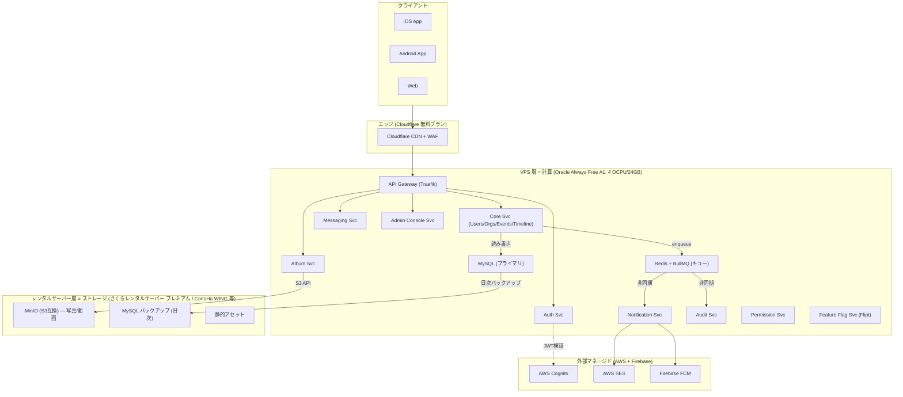
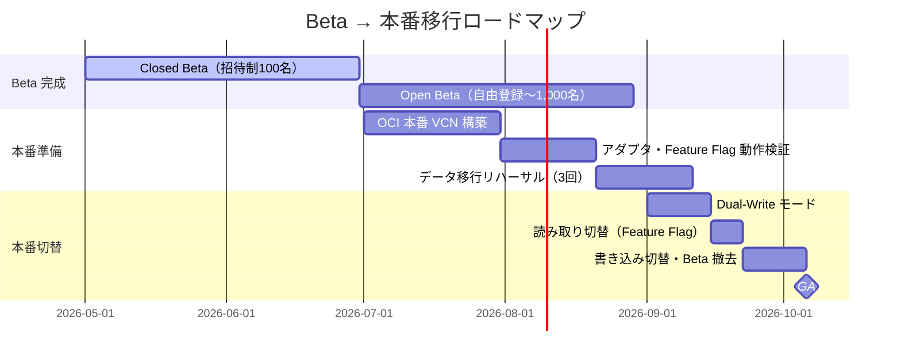

# デプロイメント戦略 — Beta → 本番マルチクラウド移行

> **対象フェーズ**: Closed Beta 〜 GA（General Availability）
> **作成日**: 2026-04-19
> **ステータス**: 承認待ち
> **関連コメント**: Notion Design Docs（2026-04-18）「SQSを採用するようにしているが、Oracleや自前のバッジ処理などで利用する場合などを複数検討した上でシステムを提案するように」

---

## 1. エグゼクティブサマリー

Recerdo は **Viejoアプリ**（旧友・仲良かったグループとのSocialMedia）として、大手SNSと異なり "限定クローズド" なトラフィック特性を持つ。この特性を最大限活かすため、以下の三段階デプロイ戦略を採る。

| フェーズ                 | 基盤                                                                          | 目的                                | 月額コスト目標 |
| ------------------------ | ----------------------------------------------------------------------------- | ----------------------------------- | -------------- |
| **Closed Beta**          | セルフホスト（VPS + レンタルサーバー）                                        | 低コスト運用、1,000MAU以内          | $20〜$50       |
| **Open Beta → 初期本番** | **OCI ファースト**（Oracle Cloud Infrastructure 東京/大阪）+ AWS Cognito 併用 | 安価クラウドで10,000MAUまでスケール | $50〜$200      |
| **GA（成熟）**           | OCI を主、AWS を Cognito/SES 等のマネージドサービスに限定                     | 50,000MAU超に対応                   | $200〜         |

**設計原則**: コードベースは **単一** を維持し、クラウド事業者・ミドルウェア実装は **ハードコードせず**、**Feature Flag + 環境変数（12-factor config）+ アダプタパターン** で差し替え可能にする。これにより、Beta → 本番切替時に「リポジトリを書き換える」のではなく「環境変数とフラグを切り替える」だけで移行できる。

---

## 2. Notion レビューコメント対応マトリクス

| コメント内容                                                                  | 本設計書での対応                                                | 関連セクション                                                                                                               |
| ----------------------------------------------------------------------------- | --------------------------------------------------------------- | ---------------------------------------------------------------------------------------------------------------------------- |
| SQS採用を全体で決めているが、代替（Oracle・自前バッジ処理）を複数検討せよ     | OSSキュー比較＋アダプタ抽象化で差し替え可能に                   | §5, [キュー抽象化設計](../microservice/queue-abstraction.md)                                                                 |
| AWSを基本としつつ Oracle Cloud など安価クラウドを利用                         | OCI ファースト戦略、AWS は Cognito/SES のみ限定利用             | §3                                                                                                                           |
| Beta版はセルフホスト（VPS + レンタルサーバー）                                | VPS＝マイクロサービス／レンタルサーバー＝ストレージ層の分離構成 | §4                                                                                                                           |
| Beta→本番でシステム改修が大変にならないように、Feature Flag・ソフト変更で対応 | 環境抽象化レイヤ＋Feature Flag駆動切替                          | §6, [環境抽象化](environment-abstraction.md)                                                                                 |
| 管理者コンソール設計がない。マイクロサービス・クリーンアーキベースで検討      | 独立マイクロサービスとして追加                                  | [Admin Console (MS)](../microservice/admin-console-svc.md)・[Admin Console (CA)](../clean-architecture/admin-console-svc.md) |

---

## 3. クラウド選定理由と制約

### 3.1 OCI ファースト戦略の根拠

- **コスト優位性**: OCI の標準コンピュートは AWS EC2 比で **約57%安価**、ブロックストレージで **約78%安価**、外向きデータ転送で **約13倍安価**（AWS: 100GB/月 vs OCI: 10TB/月の常時無料枠）
- **Always Free Tier**: ARM Ampere A1 で 4 OCPU / 24 GB RAM を無期限無料。Closed Beta の全ワークロードを実質0円で運用可能
- **日本リージョン**: 東京（ap-tokyo-1）・大阪（ap-osaka-1）を両方提供、リージョン間DRが組める
- **除外クラウド**: 中国系パブリッククラウド（Alibaba Cloud / Tencent Cloud）、および日本リージョンを持たない一部ヨーロッパ系クラウドは **データ主権要件・レイテンシー要件** から除外

!!! warning "OCI Always Free の本番利用制約"
    OCI Always Free Tier は「小規模アプリ・PoC・開発/検証用途」を対象とする規約。**Open Beta 以降は最低限 $20〜/月の有償シェイプ**（VM.Standard.A1.Flex の OCPU 課金）に切り替える前提で設計する。

### 3.2 AWS 併用範囲（Cognito + SES + FCM連携）

OCI ファーストとしつつも、以下の領域は **AWS / Firebase を維持** する：

#### TODO
- [ ] メールについてはセルフホスティングされたメールサーバーを利用する

| サービス                                    | 理由                                                                                |
| ------------------------------------------- | ----------------------------------------------------------------------------------- |
| **AWS Cognito**（認証）                     | 50,000 MAU 無料枠、Hosted UI 対応、OIDC/SAML 完備、ユーザープールの移行コストが高い |
| **Firebase FCM**（プッシュ通知）            | 完全無料・無制限、Android/iOS両対応                                                 |
| **Cloudflare R2 / CDN**（将来のエッジ配信） | R2 はエグレス無料、CDN に OCI 不足分を補填                                          |

!!! tip "Cognito 選定理由"
    Notion 設計書の更新（2026-04-15: "Cognito Hosted UI委任型認証"）で既に合意済み。認証周りはセルフホスト（Keycloak 等）ではなく、Cognito に委譲して開発工数を削減する。

### 3.3 除外候補と根拠

| クラウド                     | 除外理由                                                               |
| ---------------------------- | ---------------------------------------------------------------------- |
| GCP                          | コスト面で OCI に劣る、日本法人サポート体制が限定的                    |
| Azure                        | エンタープライズ向けで個人開発に割高、Cognito 互換性弱い               |
| Alibaba Cloud                | データ主権・法規制リスク                                               |
| 国内IaaS（さくらクラウド等） | OCI と同等価格帯だが、グローバル拡張パスが弱い（将来の海外展開を考慮） |

---

## 4. Beta フェーズ物理構成（セルフホスト）

### 4.1 物理配置の原則

Closed Beta では "VPS（計算）" と "レンタルサーバー（ストレージ）" を **物理的に分離** する。

### 4.2 VPS（計算層）

**利用対象**:
- Oracle Always Free A1（第一候補、Closed Beta は完全無料）
- XServer VPS（6Core/10GB）

**内容**:
- 全マイクロサービスを Docker Compose または k3s（Kubernetes 軽量ディストリビューション）で稼働
- Traefik をリバースプロキシ・API Gateway として使用（Let's Encrypt 自動化）
- MySQL は VPS 内で稼働、日次ダンプをレンタルサーバーへ転送

### 4.3 レンタルサーバー（ストレージ層）

**候補**:
- CoreServer (V2CORE-X / 6GB)

**内容**:
- **Garage（S3互換オブジェクトストレージ）** を設置し、Album Service・Storage Service のバックエンドとする
- MySQL 日次バックアップ保管
- 静的アセット（アプリ内画像・LP）のホスティング

!!! note "レンタルサーバー上での Garage の制約"
    レンタルサーバーは共用環境のため、SSH経由でのバイナリ実行が制限されている場合がある。Garage が動作しない場合は **「レンタルサーバー = 単純なファイル保管（rsync / FTPS 転送）」に限定** し、S3 互換 API は VPS 内で Garage を立てる構成にフォールバックする（§4.4 参照）。

### 4.4 フォールバック構成（レンタルサーバーで MinIO 起動不可の場合）

| 層                     | 代替案                                                                                                              |
| ---------------------- | ------------------------------------------------------------------------------------------------------------------- |
| オブジェクトストレージ | VPS 内 Garage（ブロックストレージ 200GB 無料枠で賄う）+ レンタルサーバーは **FTPS 経由の低頻度バックアップ** に限定 |
| バックアップ先         | Cloudflare R2（10GB 無料、エグレス完全無料）に切替可能                                                              |

---

## 5. 本番移行時のクラウドマッピング

### 5.1 コンポーネントごとの Beta → 本番マッピング

| コンポーネント         | Beta（セルフホスト）                         | 本番（OCI ファースト）                                     | 切替手段                                 |
| ---------------------- | -------------------------------------------- | ---------------------------------------------------------- | ---------------------------------------- |
| API Gateway            | Traefik on VPS                               | **OCI Load Balancer + API Gateway**（または Traefik 継続） | 環境変数 `API_GATEWAY_URL`               |
| 認証                   | Cognito（Beta から継続）                     | Cognito（継続）                                            | 変更なし                                 |
| データベース           | MySQL on VPS                                 | **OCI Autonomous Database for MySQL**                      | 接続文字列 `DATABASE_URL`                |
| キャッシュ             | Redis on VPS                                 | **OCI Cache with Redis**（または VPS Redis 継続）          | `REDIS_URL`                              |
| メッセージキュー       | **Redis + BullMQ / Sidekiq**（セルフホスト） | **OCI Queue Service**（AMQP）または **AWS SQS**            | Feature Flag `queue.provider` + アダプタ |
| オブジェクトストレージ | Garage on レンタルサーバー（or VPS）         | **OCI Object Storage**（S3互換）                           | `S3_ENDPOINT_URL`                        |
| メール                 | レンタルサーバー(メールサーバー)             | 選定予定                                                   | 変更なし                                 |
| プッシュ通知           | Firebase FCM                                 | Firebase FCM（継続）                                       | 変更なし                                 |
| Feature Flag基盤       | Flipt（セルフホスト）                        | Flipt（継続、OCI VPS 上）                                  | 変更なし                                 |
| 監査ログ保管           | MySQL + S3 冷却                              | OCI Object Storage + **Archive tier**                      | `AUDIT_ARCHIVE_BUCKET`                   |
| ログ集約               | Grafana Loki（セルフホスト）                 | OCI Logging（または Loki 継続）                            | Feature Flag `observability.stack`       |
| CDN                    | Cloudflare 無料                              | Cloudflare Pro（$20/月）+ OCI Object Storage オリジン      | `CDN_BASE_URL`                           |

### 5.2 切替単位：リポジトリ不変／環境変数可変

| 変更タイプ               | 具体例                                                                   | Beta→本番でやること                  |
| ------------------------ | ------------------------------------------------------------------------ | ------------------------------------ |
| **ハードコード禁止項目** | `queueProvider = "redis"`、`s3Endpoint = "https://minio.local"`          | ❌ コード内に直接書かない             |
| **環境変数で差し替え**   | `QUEUE_PROVIDER=redis` → `QUEUE_PROVIDER=sqs`                            | `.env.production` を書き換えるだけ   |
| **Feature Flag で切替**  | `feature.queue.useSQS=true`                                              | Flipt ダッシュボードで ON にするだけ |
| **アダプタ実装で吸収**   | `QueueAdapter` インタフェース配下に `RedisAdapter` / `SqsAdapter` を並存 | 新 Adapter 実装を追加、Flag で選択   |

詳細は [環境抽象化 & Feature Flag 駆動切替](environment-abstraction.md) を参照。

---

## 6. 移行ロードマップ

### 6.1 Dual-Write モードの詳細

**目的**: Beta インフラと本番インフラの両方に同時書き込みし、無停止移行する。

**実装**: Feature Flag `infrastructure.dualWrite.enabled=true` がONのとき、Repository レイヤが両方の接続を保持し、両系統に書く。読み取りは `infrastructure.readFrom` フラグで `beta` / `prod` / `both` を選択。

**ロールバック**: Kill Switch `infrastructure.dualWrite.killswitch=true` を引くだけで即座に Beta のみに戻す。

---

## 7. リスクと緩和策

| リスク                                                        | 影響度 | 緩和策                                                                                         |
| ------------------------------------------------------------- | ------ | ---------------------------------------------------------------------------------------------- |
| OCI Japan リージョンの Always Free 枠枯渇（近年発生している） | 中     | Open Beta 開始時に有償シェイプに先行切替、ConoHa VPS をバックアップ候補に維持                  |
| レンタルサーバーでの MinIO 動作不可                           | 中     | §4.4 のフォールバック構成を初期から検証                                                        |
| AWS Cognito の無料枠（50,000 MAU）超過                        | 低     | Open Beta で10,000 MAU 到達時点でコスト試算をアラート化                                        |
| Cloudflare 無料プランの WAF ルール制限                        | 低     | 有償プラン $20/月 で解決、本番前に切替                                                         |
| OCI ↔ AWS 間のクロスクラウド通信コスト                        | 中     | 同期通信を避け、**非同期イベント + CDN キャッシュ** で削減。OCI エグレス 10TB 無料枠内で収める |
| 単一クラウド依存による障害耐性                                | 中     | Feature Flag でマルチリージョン DR を切替可能にし、OCI 東京 ↔ 大阪 の冗長化を GA 前に構築      |

---

## 8. 運用指標（SLO）

| 指標                  | Beta 目標                  | 本番目標 |
| --------------------- | -------------------------- | -------- |
| API 可用性            | 99.0%                      | 99.9%    |
| P95 レイテンシ        | 500ms                      | 250ms    |
| キュー処理遅延（P95） | 10秒                       | 2秒      |
| 月間ダウンタイム許容  | 7時間                      | 43分     |
| RPO（復旧時点目標）   | 24時間（日次バックアップ） | 1時間    |
| RTO（復旧時間目標）   | 4時間                      | 30分     |

---

## 9. 参考文献

- [Oracle Cloud vs AWS — コスト比較（2026）](https://www.cloudwards.net/oracle-vs-aws/)
- [Oracle Cloud Always Free Tier 仕様](https://www.oracle.com/cloud/free/)
- [The Twelve-Factor App — Config](https://12factor.net/config)
- [AWS Prescriptive Guidance — Hexagonal Architecture](https://docs.aws.amazon.com/prescriptive-guidance/latest/cloud-design-patterns/hexagonal-architecture.html)

---

## 10. 関連ドキュメント

- [コストパフォーマンス分析](cost-performance-analysis.md) — 単価ベースの比較（本ドキュメントの前提）
- [環境抽象化 & Feature Flag 駆動切替](environment-abstraction.md) — ハードコード排除の実装詳細
- [キュー抽象化設計（MS）](../microservice/queue-abstraction.md) — OSS キュー比較・アダプタ層
- [Admin Console Svc（MS）](../microservice/admin-console-svc.md) — 管理者コンソールのマイクロサービス設計
- [Admin Console Svc（CA）](../clean-architecture/admin-console-svc.md) — 管理者コンソールのクリーンアーキテクチャ設計
