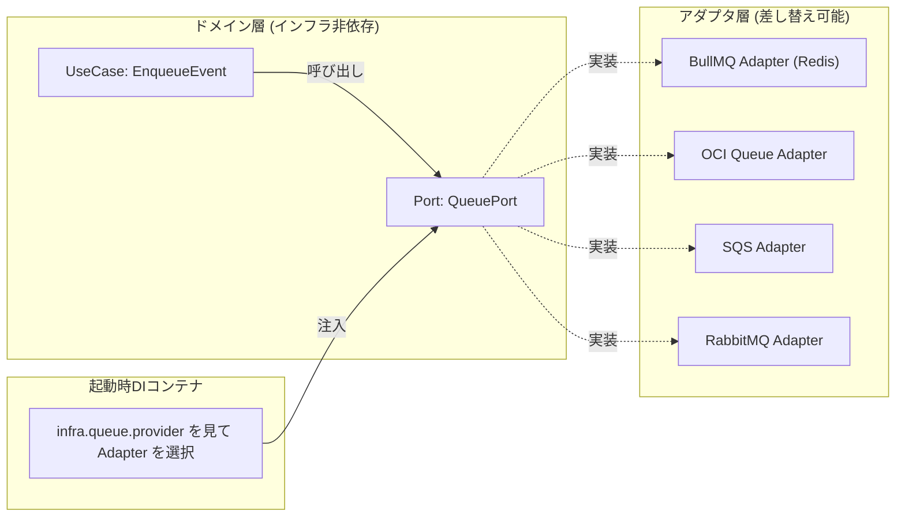

# 環境抽象化 & Feature Flag 駆動切替

> **対象フェーズ**: Closed Beta 〜 GA 全体
> **作成日**: 2026-04-19
> **ステータス**: 承認待ち
> **前提ドキュメント**: [デプロイメント戦略](deployment-strategy.md)

---

## 1. 目的

Recerdo のコードベースを **単一リポジトリ（single codebase, many deploys）** として維持し、以下の切替操作をすべて **コード変更なし** で実現する。

- Beta（セルフホスト VPS+レンタルサーバー） → 本番（OCI ファースト）への移行
- メッセージキュー実装の切替（Redis+BullMQ → OCI Queue / OSS SQS）
- オブジェクトストレージの切替（MinIO → OCI Object Storage / Garage）
- 認証プロバイダ追加（Cognito 単独 → Cognito + Auth0 などの併用）
- 特定機能の段階的ロールアウト（%ベース／組織ベース／IP ベース）
- 障害時の即時機能停止（Kill Switch）


---

## 2. 設計原則

### 2.1 三層の "差し替え可能性"

Recerdo では、環境差異を以下の **3 層** に分解して管理する。いずれもコード変更を伴わない。

| 層                                           | 手段                                       | 切替の粒度                | 反映速度             | 主な用途                             |
| -------------------------------------------- | ------------------------------------------ | ------------------------- | -------------------- | ------------------------------------ |
| **レイヤー 1: 環境変数（12-factor Config）** | OS 環境変数 / `.env` / Secret Manager      | デプロイ単位              | 再起動が必要         | DB 接続先・外部サービス URL・APIキー |
| **レイヤー 2: Feature Flag（Flipt）**        | Feature Flag Svc の評価 API                | ユーザー / 組織 / IP 単位 | リアルタイム（数秒） | 機能 ON/OFF・段階的ロールアウト・A/B |
| **レイヤー 3: アダプタ選択（DI コンテナ）**  | 起動時に Interface → Implementation を注入 | プロセス単位              | 再起動が必要         | Queue / Storage / Auth の実装切替    |

### 2.2 Twelve-Factor Config への準拠

[12-factor config](https://12factor.net/config) に準拠し、以下を遵守する：

- ✅ **環境変数で設定を渡す**（設定ファイルではなく）
- ✅ **コードと設定を厳密に分離**（コードを即 OSS 公開してもシークレットが漏れない）
- ✅ **"環境"（dev/beta/prod）をグループ化しない**（個々の環境変数は独立管理）
- ❌ **`if env == "production"` のような分岐禁止**（値の差ではなく動作の差で判断する）

!!! warning "禁止パターン"
    ```go
    // ❌ BAD: 環境名で動作を切り替える
    if os.Getenv("APP_ENV") == "production" {
        useAWSSQS()
    } else {
        useLocalRedis()
    }
    ```
    ```go
    // ✅ GOOD: 具体的な設定値で判断
    queue := NewQueue(cfg.QueueProvider) // "redis" | "sqs" | "oci-queue"
    ```

### 2.3 Feature Flag の評価ポリシー

- 全サービスは [Feature Flag Svc（recuerdo-feature-flag-svc）](../microservice/feature-flag-system.md) に `EvaluateFlag` で問い合わせる
- 評価結果は **ローカルキャッシュ TTL 30 秒**（障害時のフォールバックは "最後の既知値" を維持）
- すべての評価は **FlagEvaluation テーブルに記録**（§4.3 参照）

---

## 3. 環境変数カタログ

### 3.1 命名規約

- `UPPER_SNAKE_CASE`
- ドメイン別プレフィックス：`QUEUE_*`、`STORAGE_*`、`AUTH_*`、`DB_*`
- シークレット接尾辞：`_SECRET`、`_TOKEN`、`_KEY`（ログから自動マスク対象）

### 3.2 主要な環境変数（抜粋）

| 変数名                  | Beta 既定値                        | 本番既定値                                                         | 説明                               |
| ----------------------- | ---------------------------------- | ------------------------------------------------------------------ | ---------------------------------- |
| `APP_ENV`               | `beta`                             | `production`                                                       | ログ識別のみに使用（動作分岐禁止） |
| `QUEUE_PROVIDER`        | `redis-bullmq`                     | `oci-queue` or `aws-sqs`                                           | Queue 実装を選択                   |
| `QUEUE_URL`             | `redis://vps-redis:6379/0`         | `https://cell-1.queue.ap-tokyo-1.oci.oraclecloud.com/...`          | 接続先                             |
| `STORAGE_PROVIDER`      | `minio`                            | `oci-oss` or `aws-s3`                                              | オブジェクトストレージ実装         |
| `STORAGE_ENDPOINT`      | `https://minio.rental.example.com` | (空=リージョン既定)                                                | S3 API エンドポイント              |
| `STORAGE_BUCKET_ALBUM`  | `recerdo-album-beta`               | `recerdo-album-prod-apnortheast`                                   | バケット名                         |
| `DATABASE_URL`          | `MySQL://...@vps-db:5432/recerdo`  | `MySQL://...@autonomousdb.ap-tokyo-1.oci.oraclecloud.com:5432/...` | DB 接続文字列                      |
| `REDIS_URL`             | `redis://vps-redis:6379/1`         | `rediss://cache.ap-tokyo-1.oci.oraclecloud.com:6379`               | Redis 接続                         |
| `AUTH_COGNITO_POOL_ID`  | `ap-northeast-1_xxxxxxxxx`         | `ap-northeast-1_yyyyyyyyy`                                         | Cognito User Pool                  |
| `FEATURE_FLAG_URL`      | `http://flipt:8080`                | `http://flipt-internal.vcn:8080`                                   | Flipt エンドポイント               |
| `OBSERVABILITY_BACKEND` | `loki`                             | `oci-logging` or `loki`                                            | ログ集約先                         |
| `CDN_BASE_URL`          | `https://cdn-beta.recerdo.app`     | `https://cdn.recerdo.app`                                          | CDN 公開 URL                       |
| `AUDIT_ARCHIVE_BUCKET`  | `recerdo-audit-beta`               | `recerdo-audit-archive-prod`                                       | 監査ログ冷蔵バケット               |

### 3.3 シークレット管理

- **Beta**: VPS の `.env.local`（ファイルパーミッション 600）+ `sops + age` 暗号化で Git 管理
- **本番**: **OCI Vault**（または AWS Secrets Manager）から起動時に環境変数へ注入
- **CI/CD**: GitHub Actions の Environment Secrets、`NETLIFY_SITE_ID` 等は既に設定済み

---

## 4. Feature Flag カタログ（インフラ系）

機能系フラグは [機能仕様：Feature Flag 管理](../features/permission/feature-flags.md) を参照。本節では **インフラ・アーキテクチャ切替** 専用のフラグを記載する。

### 4.1 インフラ切替フラグ

| Flag Key                          | 型      | 用途                           | Beta 既定値    | 本番既定値           |
| --------------------------------- | ------- | ------------------------------ | -------------- | -------------------- |
| `infra.queue.provider`            | VARIANT | Queue 実装選択                 | `redis-bullmq` | `oci-queue`          |
| `infra.storage.provider`          | VARIANT | Storage 実装選択               | `minio`        | `oci-oss`            |
| `infra.dualWrite.enabled`         | BOOLEAN | Beta/本番両系への二重書き込み  | `false`        | `true`（移行中のみ） |
| `infra.readFrom`                  | VARIANT | 読み取り先指定                 | `beta`         | `both` → `prod`      |
| `infra.queue.killswitch`          | BOOLEAN | 全キュー処理を一時停止         | `false`        | `false`              |
| `infra.cdn.aggressive-cache`      | BOOLEAN | CDN で全レスポンスをキャッシュ | `false`        | `true`               |
| `infra.observability.sample-rate` | VARIANT | トレーシングサンプリング率     | `0.1`          | `0.01`               |

### 4.2 段階的ロールアウトの例

本番切替時は、**Percentage Rollout** を使う：

```yaml
# Flipt config (例)
flag: infra.storage.provider
rules:
  - priority: 1
    segment: internal-team  # 社内テスター
    variant: oci-oss
  - priority: 2
    rollout:
      percentage: 10        # 一般ユーザー 10%
      variant: oci-oss
  - priority: 3
    variant: minio          # 残り 90%
```

ダッシュボードで 10 → 30 → 50 → 100 % と段階的に増やし、エラー率悪化を検知したら即ロールバック。

### 4.3 評価ログとコンプライアンス

すべての Feature Flag 評価は `FlagEvaluation` テーブルに記録し、以下を満たす：

- **7 日間のホットストレージ保持**（問題調査用）
- **30 日経過後は Audit 冷蔵バケットへ移送**
- **Kill Switch 発動は Audit Svc へ同期通知**（監査要件）

---

## 5. アダプタパターン実装（Hexagonal Architecture）

### 5.1 ポートとアダプタ

ドメイン層は "Port"（インタフェース）のみを知り、"Adapter"（具象実装）は起動時に DI で差し込む。



### 5.2 Go での実装サンプル

```go
// ドメイン層 (domain/port/queue.go)
type QueuePort interface {
    Enqueue(ctx context.Context, job Job) error
    Dequeue(ctx context.Context) (Job, error)
}

// UseCase (application/enqueue_event.go)
type EnqueueEvent struct {
    queue QueuePort // <- ドメインは Port のみ知る
}

func (u *EnqueueEvent) Execute(ctx context.Context, ev Event) error {
    return u.queue.Enqueue(ctx, Job{Type: "event", Payload: ev})
}

// アダプタ (adapter/queue/bullmq_adapter.go)
type BullMQAdapter struct { /* Redis 接続 */ }
func (a *BullMQAdapter) Enqueue(...) error { /* BullMQ API */ }

// アダプタ (adapter/queue/sqs_adapter.go)
type SQSAdapter struct { /* AWS SDK */ }
func (a *SQSAdapter) Enqueue(...) error { /* SQS SendMessage */ }

// DIコンテナ (cmd/main.go)
func buildQueue(cfg Config, ff FeatureFlagClient) QueuePort {
    provider := ff.StringVariant("infra.queue.provider", cfg.QueueProvider)
    switch provider {
    case "redis-bullmq": return NewBullMQAdapter(cfg)
    case "oci-queue":    return NewOCIQueueAdapter(cfg)
    case "aws-sqs":      return NewSQSAdapter(cfg)
    case "rabbitmq":     return NewRabbitMQAdapter(cfg)
    default:             log.Fatalf("unknown provider: %s", provider)
    }
    return nil
}
```

### 5.3 参考実装

- **omniqueue-rs**（Rust）: Redis / RabbitMQ / SQS を統一インタフェースで抽象化した OSS
- **CloudEvents SDK**（CNCF）: クラウド間で互換のあるイベントフォーマット
- **OpenFeature SDK**（CNCF）: Feature Flag プロバイダの統一インタフェース

---

## 6. 変更の影響範囲テスト

アダプタ差替えの正しさは、**ドメイン層の単体テストは差し替えても同じく PASS** することで検証する。

### 6.1 テストマトリクス（CI 実行）

| テスト種別                | 対象                              | 実行条件   |
| ------------------------- | --------------------------------- | ---------- |
| ユニット（Port モック）   | ドメイン・UseCase                 | 全 PR      |
| 統合（BullMQ Adapter）    | Redis docker-compose              | 全 PR      |
| 統合（SQS Adapter）       | LocalStack                        | 全 PR      |
| 統合（OCI Queue Adapter） | 夜間ジョブ（本物の OCI テナント） | nightly    |
| 負荷テスト                | 本番相当クラウド                  | リリース前 |

### 6.2 契約テスト（Contract Test）

各 Adapter は **同一の Port 契約** を満たすことを保証する：

```go
// adapter/queue/contract_test.go
func TestQueuePortContract(t *testing.T) {
    providers := []QueuePort{
        NewBullMQAdapter(testCfg),
        NewSQSAdapter(testCfg),
        NewOCIQueueAdapter(testCfg),
    }
    for _, p := range providers {
        t.Run(fmt.Sprintf("%T", p), func(t *testing.T) {
            // Enqueue / Dequeue / 冪等性 / DLQ 挙動を検証
            assertQueueContract(t, p)
        })
    }
}
```

---

## 7. セキュリティ考慮

### 7.1 シークレットのローテーション

- **目標**: 四半期ごとに全シークレットをローテーション
- **実装**: OCI Vault のローテーション機能を使用、アプリは起動時再読み込み
- **Feature Flag 認証**: Flipt は**読み取り専用トークン**を各 Svc に配布し、書き込みは Admin Console からのみ

### 7.2 Feature Flag の改ざん対策

- Flipt への書き込みは **Admin Console Svc 経由** に限定
- すべての変更は Permission Svc の RBAC と Audit Svc への同期記録を伴う
- 本番環境のフラグ変更は **二段階承認**（申請者 + 承認者）を Admin Console に実装

### 7.3 Kill Switch 発動の監査

- エラー率閾値超過で自動発動した場合、**Slack + Email で即時通知**
- 手動発動は承認ワークフローを経由、発動者を監査ログに記録

---

## 8. ロールアウト／ロールバック手順

### 8.1 標準ロールアウト

```
1. 新 Adapter 実装を PR でマージ
2. staging 環境で `infra.*.provider` を新値に切替 → 統合テスト
3. 本番で Percentage Rollout 5% → 監視 → 20% → 50% → 100%
4. 旧 Adapter の環境変数を削除、次リリースでコード削除
```

### 8.2 緊急ロールバック

```
1. Flipt ダッシュボードで Kill Switch `infra.*.killswitch=true` 発動
2. アプリは即座に旧 Adapter へフォールバック（30秒以内）
3. インシデント調査と原因修正
4. 修正後、Kill Switch を解除して段階再開
```

---

## 9. 参考文献

- [The Twelve-Factor App — Config](https://12factor.net/config)
- [OpenFeature — CNCF 標準の Feature Flag 仕様](https://openfeature.dev/)
- [Flipt — セルフホスト OSS Feature Flag](https://www.flipt.io/)
- [Hexagonal Architecture — AWS Prescriptive Guidance](https://docs.aws.amazon.com/prescriptive-guidance/latest/cloud-design-patterns/hexagonal-architecture.html)
- [omniqueue-rs — Queue 抽象化実装例](https://github.com/svix/omniqueue-rs)

---

## 10. 関連ドキュメント

- [デプロイメント戦略](deployment-strategy.md)
- [キュー抽象化設計（MS）](../microservice/queue-abstraction.md)
- [Feature Flag 管理システム（MS）](../microservice/feature-flag-system.md)
- [Feature Flag 管理（機能仕様）](../features/permission/feature-flags.md)
