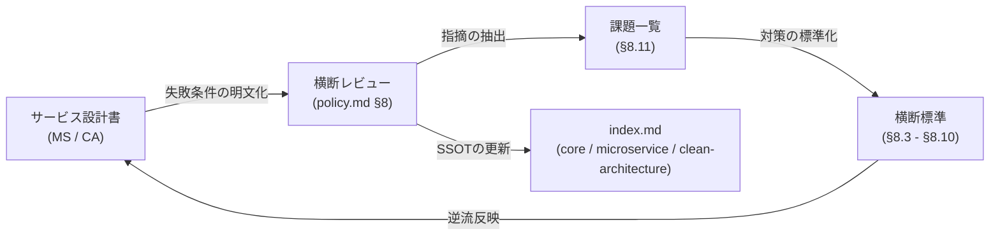

# 基本的方針 (Policy)

> **対象フェーズ**: Closed Beta 〜 GA 全体
> **最終更新**: 2026-04-19 ポリシー適用
> **位置づけ**: 全ドキュメントの上位方針。個別ドキュメントとの矛盾時は本ドキュメントを優先する。
> **関連コミット**: `80d563d — 基本的方針（ポリシーの適用）`

---

## 1. クラウド / インフラ

### 1.1 Beta フェーズ（Closed Beta 〜 Open Beta）

すべて **OSS / セルフホスト**。AWS は **Cognito のみ** 利用する。

| レイヤ                        | プロダクト                                                                   | ホスト先            |
| ----------------------------- | ---------------------------------------------------------------------------- | ------------------- |
| 計算（VPS）                   | **XServer VPS（6 core / 10 GB RAM）**                                        | XServer VPS         |
| ストレージ／メール            | **CoreServerV2 CORE+X（6 GB）**                                              | CoreServer          |
| オブジェクトストレージ        | **Garage**（S3 互換 OSS、分散対応）                                          | CoreServerV2 CORE+X |
| データベース                  | **MySQL 8.0**（スキーマは **MariaDB 10.11 互換** を必須条件とする）          | XServer VPS         |
| キャッシュ                    | **Redis**（OSS）                                                             | XServer VPS         |
| メッセージキュー              | **Redis + BullMQ**（Node/TS）／**hibiken/asynq**（Go）                       | XServer VPS         |
| メール                        | **Postfix + Dovecot + Rspamd**（SPF / DKIM / DMARC / IP ウォームアップ必須） | CoreServerV2 CORE+X |
| 認証                          | **AWS Cognito**（Hosted UI、JWKS 検証）                                      | AWS                 |
| プッシュ通知                  | **Firebase Cloud Messaging (FCM)**                                           | Google              |
| Feature Flag                  | **Flipt**（OSS）                                                             | XServer VPS         |
| オブザーバビリティ            | Prometheus + Grafana + Loki + Alertmanager                                   | XServer VPS         |
| リバースプロキシ／API Gateway | Traefik（Let's Encrypt 自動化）                                              | XServer VPS         |
| CDN / WAF                     | Cloudflare 無料プラン                                                        | Cloudflare          |

### 1.2 本番フェーズ（GA）

**Oracle Cloud Infrastructure (OCI) ファースト**。AWS は **Cognito のみ** 継続。メールは CoreServerV2 を継続利用する（ポリシー）。

| レイヤ                 | プロダクト                                                                                                                        |
| ---------------------- | --------------------------------------------------------------------------------------------------------------------------------- |
| 計算                   | OCI Compute（VM.Standard.A1.Flex 等、ARM Ampere）                                                                                 |
| オブジェクトストレージ | **OCI Object Storage**（S3 互換 API）                                                                                             |
| データベース           | **OCI MySQL HeatWave** もしくは **MySQL Database Service**（スキーマは MariaDB 10.11 互換を維持）                                 |
| キャッシュ             | **OCI Cache with Redis**                                                                                                          |
| メッセージキュー       | **OCI Queue Service**（AMQP 1.0）                                                                                                 |
| メール                 | **CoreServerV2 CORE+X 上の Postfix + Dovecot + Rspamd**（継続。将来的な OCI Email Delivery 移行は Feature Flag で切替可能にする） |
| 認証                   | AWS Cognito（継続）                                                                                                               |
| プッシュ通知           | FCM（継続）                                                                                                                       |
| Feature Flag           | Flipt（OCI VPS 上）                                                                                                               |
| オブザーバビリティ     | OCI Logging / OCI Monitoring 併用、Loki 併走可                                                                                    |

### 1.3 AWS 利用ポリシー

- **利用可能**: Cognito（User Pool・Hosted UI・JWKS）のみ。
- **利用しない**（過去資料に登場する場合は差し替え対象）:
    - AWS **SES / SNS / SQS / DynamoDB / RDS / Aurora / EC2 / EKS / ECS / Fargate / ElastiCache / Lambda / CloudWatch / CloudFront / S3 / Secrets Manager / Shield / WAF / GuardDuty** その他全て
- 他クラウドサービスの利用判断は本ドキュメントへの追記を以て確定とする。

### 1.4 AWS 以外の第三者 SaaS 利用

- **利用**: Firebase FCM、Cloudflare（CDN）、Netlify（ドキュメントサイトホスティング）。
- **未採用**: SendGrid・OneSignal・Auth0・Supabase 等のマネージド代替（理由：AWS Cognito + Postfix + Flipt の自前構成で充足）。

---

## 2. メディア処理

### 2.1 自動変換パイプライン

アップロード時点で以下の変換を **自動実行**（同期/非同期はキュー経由）。

| 入力                                | 出力                                                                                                                                                         |
| ----------------------------------- | ------------------------------------------------------------------------------------------------------------------------------------------------------------ |
| 動画（mp4 / mov / hevc / h.264 他） | **HLS（360p / 720p / 1080p、6秒セグメント、master.m3u8 + variant playlists）** + サムネイル。原本はアーカイブ保持。                                          |
| **HEIC / HEIF**                     | **JPEG（q=85）+ WebP（q=80）**（libheif / go-libheif）。原本はアーカイブ保持。                                                                               |
| **Live Photo**（HEIC + MOV のペア） | 画像部は HEIC → JPEG/WebP。動画部は HLS。両者を **Apple `com.apple.quicktime.content.identifier`**（asset_identifier）で紐付け、UI 上は 1 カードとして表示。 |
| 通常画像（JPEG / PNG / WebP）       | サムネイル生成（AVIF 検討）、EXIF の回転補正を自動適用。                                                                                                     |

技術スタック:

- 動画トランスコード: **FFmpeg**（`ffmpeg-hls` アダプタ）。CPU 負荷対策のため worker pool + 夜間バッチ化を併用。
- HEIC 変換: **libheif / go-libheif**。
- ポート名: `MediaTranscoderPort`、アダプタ名: `FFmpegHLSAdapter` / `LibheifImageAdapter`。

### 2.2 ハイライトビデオ

- **ユーザー選択方式**に限定する。ML・クラスタリング等による **自動生成は行わない**。
- API（`POST /api/media/{org_id}/highlights`、`POST /albums/{album_id}/highlights` 等）は `media_ids[]` を必須パラメータとし、ユーザーが選んだメディアの **FFmpeg concat** 結果を HLS として書き出す。
- サーバ側の機能は「連結」「トランジションの付与（オプション）」「HLS 化」のみ。

### 2.3 ストレージ削除

- 論理削除（`deleted_at` 設定）＋ **30 日保持** ののち、原本 + 派生ファイルを物理削除。
- 監査系データはより長期の階層保管（§3.2 参照）。

---

## 3. データベース

### 3.1 エンジン

- **Beta**: **MySQL 8.0**（XServer VPS 上で起動、日次ダンプを CoreServerV2 へ転送）。
- **本番**: **OCI MySQL HeatWave**（または MySQL Database Service）。
- **互換性**: **MariaDB 10.11 と同一 SQL が通ること** を必須要件とする。これにより将来的に MariaDB への切替余地を残し、ロックインを回避する。
    - 利用可: `WINDOW 関数` / `CTE` / `JSON 型` / `GENERATED COLUMN` / `CHECK 制約（10.2+）`。
    - 利用不可（MySQL 固有）: `JSON_TABLE`（MariaDB 10.6+ で対応だが互換性確認のため避ける）、`SELECT … FOR UPDATE SKIP LOCKED`（MariaDB 10.6+）など差異の大きな機能。差異は [MariaDB vs MySQL Compatibility](https://mariadb.com/docs/release-notes/community-server/about/compatibility-and-differences/mariadb-vs-mysql-compatibility) を正として判定する。
    - マイグレーションは **Flyway / Liquibase** いずれかで管理し、CI で **MySQL 8.0 + MariaDB 10.11 両方** に流して通ることを確認する。

### 3.2 階層保管ポリシー（監査 / Timeline 等の長期データ）

| 段階 | 保管先                                                   | 典型期間 |
| ---- | -------------------------------------------------------- | -------- |
| Hot  | MySQL / MariaDB                                          | 〜2年    |
| Warm | Garage（Beta）/ OCI Object Storage（本番）標準ストレージ | 2〜7年   |
| Cold | Garage / **OCI Object Storage Archive tier**             | 7年      |
| 削除 | 物理削除（監査対象は別途保管）                           | 7年超    |

S3 へのアーカイブ記述は **すべて禁止**。"S3 互換 API" という表現はアダプタ層の SDK（Garage / OCI 双方をカバーする `aws-sdk-go-v2/service/s3`）を指す場合に限り使用可。

---

## 4. 設計原則

### 4.1 単一コードベース（12-factor）

- 単一リポジトリ。環境差異は **環境変数** と **Feature Flag（Flipt）** で吸収する。
- `if env == "production"` のような環境名分岐は **禁止**。具体的な設定値（`provider == "oci-queue"` 等）で判断する。
- 詳細: [環境抽象化 & Feature Flag](environment-abstraction.md)

### 4.2 ヘキサゴナルアーキテクチャ（Ports & Adapters）

ドメイン層は **Port（インタフェース）** のみを知る。Adapter 実装は DI で差し込む。

**標準ポート名**:

- `StoragePort` / `QueuePort` / `MailPort` / `MediaTranscoderPort` / `CachePort` / `AuthPort` / `FeatureFlagPort` / `ObjectStorageArchivalPort` / `AuditEventPort`

**標準アダプタ名**:

- Storage: `GarageStorageAdapter` / `OCIObjectStorageAdapter`
- Queue: `RedisBullMQAdapter` / `AsynqAdapter` / `OCIQueueAdapter`
- Mail: `PostfixSMTPAdapter`
- Media: `FFmpegHLSAdapter` / `LibheifImageAdapter`
- Auth: `CognitoAuthAdapter`

**禁止アダプタ名**（過去のドキュメントに残存する場合は削除／改名）:

- `S3Adapter` / `S3StorageAdapter` / `MinioAdapter`
- `SQSAdapter` / `SNSAdapter` / `SESAdapter` / `SESEmailAdapter`
- `DynamoDBAdapter` / `RDSAdapter` / `ElastiCacheAdapter`

### 4.3 Feature Flag 駆動

- すべての大きな切替（Beta → 本番、アダプタ入替、段階的ロールアウト、Kill Switch）は Flipt 経由。
- 評価は [Feature Flag Svc](../microservice/feature-flag-system.md) の `EvaluateFlag` に集約し、ローカルキャッシュ TTL 30 秒。

---

## 5. セキュリティ

- **シークレット管理**: Beta = sops + age（`.env.local` を暗号化して Git 管理） / 本番 = OCI Vault。AWS Secrets Manager は不使用。
- **JWT 検証**: Cognito JWKS（`lestrrat-go/jwx` 等）を API Gateway で実施。
- **WAF / DDoS 対策**: Cloudflare（Beta）、OCI WAF（本番）。AWS Shield / WAF は不使用。
- **バックアップ暗号化**: Garage / OCI Object Storage の SSE + アプリ側 age 暗号化（多層）。

---

## 6. 関連ドキュメント

- [デプロイメント戦略](deployment-strategy.md)
- [環境抽象化 & Feature Flag](environment-abstraction.md)
- [コストパフォーマンス分析](cost-performance-analysis.md)
- [サーバーキャパシティ計画](server-capacity-planning.md)
- [ファイアウォール & データプロテクション](firewall-data-protection.md)
- [PoC / Beta スコープ](poc-beta-scope.md)
- [キュー抽象化設計](../microservice/queue-abstraction.md)
- [マイクロサービス一覧](../microservice/index.md)
- [クリーンアーキテクチャ一覧](../clean-architecture/index.md)

---

## 7. 参考

- [Garage — 分散 S3 互換オブジェクトストレージ OSS](https://garagehq.deuxfleurs.fr/documentation/)
- [MariaDB versus MySQL — Compatibility](https://mariadb.com/docs/release-notes/community-server/about/compatibility-and-differences/mariadb-vs-mysql-compatibility)
- [Postfix + Dovecot + Rspamd 運用ガイド](https://www.dchost.com/blog/en/i-built-my-own-mail-server-postfix-dovecot-rspamd-and-the-calm-path-to-deliverability-with-ip-warm%E2%80%91up/)
- [Building an Event-Driven HLS Video Streaming Platform with FFmpeg and Microservices](https://medium.com/@nileshdeshpandework/building-an-event-driven-hls-video-streaming-platform-with-ffmpeg-and-microservices-1839adabbb85)
- [libheif / go-libheif](https://github.com/MaestroError/go-libheif)
- [Apple Live Photo の構造（HEIC + MOV のペア）](https://www.whexy.com/dyn/ec968903-2fab-44ac-8003-62d14cacc2f5)

---

## 8. 追加設計プラン（大規模類似サービス参照・反復版） { #8-大規模類似サービス参照反復版 }

本節は、コミット `464267 — 基本的方針の全ドキュメント反映` のレビュー指摘（STARTTLS 要件・旧システム記述削除・横断一貫性）を起点として、**「設計 → 分析 → 課題抽出 → レビュー反映」の反復** をドキュメント化するための補助基準である。個別サービス設計書が増えても本節が **横断 SSOT（Single Source of Truth）** として機能する。

### 8.1 参照した大規模類似サービスと反映テーマ

| テーマ                   | 参照サービスの一般的モデル                                                                                                                | Recuerdo での反映                                                                                                     | 関連ドキュメント                                                                                                                        |
| ------------------------ | ----------------------------------------------------------------------------------------------------------------------------------------- | --------------------------------------------------------------------------------------------------------------------- | --------------------------------------------------------------------------------------------------------------------------------------- |
| メディアの階層ストレージ | Google Photos / iCloud Photos の Hot→Warm→Cold 配置と CDN オフロード                                                                      | Garage（Beta）/ OCI Object Storage（Prod）の Hot/Warm/Cold を §3.2 で定義、CDN は Cloudflare 固定                     | [storage-svc（MS）](../microservice/storage-svc.md) / [storage-svc（CA）](../clean-architecture/storage-svc.md)                         |
| フィード生成             | Instagram / Twitter の **Fan-out on Write（書込時ファンアウト）** と **Fan-out on Read**、および **ハイブリッド**（フォロワー規模で切替） | Recuerdo は家族/少人数グループに特化するため **Fan-out on Write 既定**、巨大グループ（>500人）は Read-time 算出に切替 | [timeline-svc（MS）](../microservice/timeline-svc.md) / [timeline-svc（CA）](../clean-architecture/timeline-svc.md)                     |
| 通知配信                 | FCM + APNs の Push-first + 条件付き Email フォールバック（Meta / LINE）                                                                   | FCM 既定、Postfix は `SECURITY_ALERT` 等 5 条件に限定（notifications-svc §5.3）                                       | [notifications-svc（MS）](../microservice/notifications-svc.md) / [notifications-svc（CA）](../clean-architecture/notifications-svc.md) |
| 冪等な API               | Stripe / Shopify の `Idempotency-Key` ヘッダ + 24h リプレイ保護                                                                           | 全 Write API で `Idempotency-Key`（UUID v4 推奨）を受け付け、`user_id + endpoint + key` で 24h 保持                   | §8.3                                                                                                                                    |
| 非同期処理の信頼性       | Debezium / Eventuate の **Transactional Outbox** + **at-least-once** + **DLQ**                                                            | `outbox_events` テーブル + ポーリング Publisher、全サービス共通                                                       | §8.4                                                                                                                                    |
| 多段ワークフロー         | Uber / Airbnb の **Saga（Choreography）** + 補償トランザクション                                                                          | アップロード → トランスコード → タイムライン反映 → 通知 を Choreography Saga で連携                                   | §8.5                                                                                                                                    |
| 外部依存の耐障害性       | Netflix / Resilience4j の **Circuit Breaker** + Exponential Backoff with Jitter                                                           | FCM / Cognito / OCI Object Storage 呼び出しに `gobreaker` 等で適用                                                    | §8.6                                                                                                                                    |
| 可観測性                 | CNCF OpenTelemetry + W3C Trace Context                                                                                                    | 全サービスで `traceparent` 伝播、RED メトリクス（Rate/Errors/Duration）を標準化                                       | §8.7                                                                                                                                    |
| 信頼性目標               | Google SRE の **SLI/SLO + エラーバジェット**                                                                                              | 主要 UX パス（アップロード・フィード取得・通知配信）に P95/P99 SLO を定義                                             | §8.8                                                                                                                                    |
| レート制限               | Stripe / Twitter の **Token Bucket per user/API key**                                                                                     | API Gateway + Redis でユーザー単位 60 req/min、429 + `Retry-After`                                                    | §8.9                                                                                                                                    |
| コンテンツ重複排除       | Dropbox / Git の **Content-Addressable Storage (CAS)**                                                                                    | アップロード時に SHA-256 を計算し、同一ハッシュは参照カウントで共有（§8.10）                                          | [storage-svc（CA）](../clean-architecture/storage-svc.md)                                                                               |

### 8.2 反復サイクル（設計 → 分析 → レビュー → 反映）



各回の反復で以下を必ず満たす:

1. **設計書の失敗条件を明文化**（例: 「STARTTLS 非対応時はエラー」）。
2. **Port / Use Case の責務に落とし込む**（例: `MailPort.SendEmail` が STARTTLS 未広告時に error を返す）。
3. **レビュー指摘を policy.md §8 に逆流反映**（ダブル記述を排除）。
4. **index.md の横断表を更新**。

### 8.3 冪等性（Idempotency Key）

- **適用範囲**: 全 Write API（POST / PUT / PATCH / DELETE）。Read 系は対象外。
- **ヘッダ名**: `Idempotency-Key`（値は UUID v4 推奨、最大 255 文字）。
- **保持期間**: 24 時間（Redis キー `idempotency:{user_id}:{endpoint}:{key}`）。
- **振る舞い**:
    - 同一キーで同一リクエスト → キャッシュ済みのレスポンスを返却（HTTP ステータスコードも再現）。
    - 同一キーで**異なる** body / 異なる endpoint → `409 Conflict` + `idempotency_key_mismatch`。
    - キー未指定 → 通常処理（**警告ログ** を残す。Beta → GA 移行時に必須化予定）。
- **参照**: [Stripe Idempotent Requests](https://docs.stripe.com/api/idempotent_requests), [Shopify Idempotent API](https://shopify.dev/docs/api/usage/idempotency)

### 8.4 Transactional Outbox パターン

- **目的**: DB 書込と QueuePort 送信のアトミック性を、2PC を使わずに確保する。
- **標準テーブル**:

    ```sql
    CREATE TABLE outbox_events (
      event_id        CHAR(36)    PRIMARY KEY,
      aggregate_type  VARCHAR(64) NOT NULL,
      aggregate_id    CHAR(36)    NOT NULL,
      event_type      VARCHAR(64) NOT NULL,
      payload         JSON        NOT NULL,
      trace_id        VARCHAR(64),
      created_at      DATETIME(6) NOT NULL,
      published_at    DATETIME(6),
      status          ENUM('PENDING','PUBLISHED','DEAD') NOT NULL DEFAULT 'PENDING',
      INDEX idx_status_created (status, created_at)
    ) ENGINE=InnoDB;
    ```

- **Publisher**: 5 秒ごとにポーリングし、`PENDING` を QueuePort に送信 → 成功時 `PUBLISHED`、3 回失敗で `DEAD`（DLQ 同等）。
- **禁止事項**: アプリケーションコードから QueuePort を**直接 Publish してはならない**（ドメインイベントは常に Outbox 経由）。
- **CA への反映**: `EventPublisherPort.PublishAsync(event)` が内部で Outbox に書き込み、Framework 層のポーラーが QueuePort へ転送。

### 8.5 Saga（Choreography）

- **採用方式**: **Choreography（各サービスがイベントで自律連携）**。中央オーケストレータは原則置かない。
- **典型フロー（アップロード → 公開）**:

    ```
    storage-svc   : MediaUploaded          → Outbox
    storage-svc   : 受信 MediaUploaded     → HLS/HEIC 変換開始
    storage-svc   : MediaTranscoded        → Outbox
    album-svc     : 受信 MediaTranscoded   → アルバム状態更新
    album-svc     : MemoryPublished        → Outbox
    timeline-svc  : 受信 MemoryPublished   → タイムラインに挿入
    notifications-svc : 受信 MemoryPublished → 通知送信
    ```

- **補償トランザクション**: 変換失敗時は `MediaTranscodeFailed` を発行し、storage-svc が論理削除 + クリーンアップ、album-svc は下書き状態に戻す。
- **タイムアウト**: Saga 全体の SLA は 10 分。超過時は admin-console-svc に `SagaTimedOut` 通知。

### 8.6 Circuit Breaker + 指数バックオフ

- **適用対象（必須）**: FCM API、AWS Cognito JWKS、OCI Object Storage、OCI Queue Service、Postfix SMTP、Flipt 評価。
- **既定しきい値**:
    - 失敗率 **50%（直近 20 リクエスト）** で Open。
    - Open 維持 **30 秒** → Half-Open で 1 回試行。
    - Retry: `base=200ms, factor=2, jitter=±25%, max_retries=3`（Outbox 側では追加の 3 回を別途許容）。
- **実装**: Go は [`sony/gobreaker`](https://github.com/sony/gobreaker)、Ruby は [`stoplight`](https://github.com/bolshakov/stoplight)。
- **Kill Switch**: Flipt で `circuit.breaker.<port>.disabled=true` を切替可能にし、障害訓練や強制バイパスに使う。

### 8.7 可観測性（OpenTelemetry + RED メトリクス）

- **トレース**: すべての HTTP / QueuePort 通信で **W3C Trace Context (`traceparent`)** を伝播する。OTel SDK は Go / Ruby とも v1.x を採用。
- **共通メトリクス（RED 法）**:
    - `http_requests_total{service, endpoint, status}` — Rate
    - `http_requests_errors_total{service, endpoint, error_kind}` — Errors
    - `http_request_duration_seconds_bucket{service, endpoint}` — Duration
- **共通ログ属性（JSON）**: `service`, `trace_id`, `span_id`, `user_id`, `tenant_id`, `event_type`, `severity`。PII は `user_id` 等の ID に限定し、本文や email をログに出さない。
- **エクスポート先**: Beta は Prometheus + Loki（VPS）、Prod は **OCI Monitoring + Loki 併走**（ベンダロックイン回避）。

### 8.8 SLI/SLO 基準（ユーザー体験ベース）

| ドメイン           | SLI                                       | SLO（ローリング 30 日） | エラーバジェット逼迫時の対処           |
| ------------------ | ----------------------------------------- | ----------------------- | -------------------------------------- |
| アップロード       | `POST /api/storage/media` P95 レイテンシ  | < 2s（1MB まで）        | トランスコード同時実行数を Flag で抑制 |
| タイムライン取得   | `GET /api/timeline` P95                   | < 500ms                 | Fan-out on Read への切替（Flag）       |
| 通知配信           | NotificationCreated → FCM Sent の 95%tile | < 60s                   | 再試行 TTL を延長、DLQ 監視を強化      |
| 認証               | JWKS 検証 P99                             | < 50ms                  | JWKS キャッシュ TTL を延長             |
| ドキュメントサイト | Netlify 応答                              | 可用性 99.9%            | バッジ / ステータスページで通知        |

- **エラーバジェット**: `1 - SLO` を月次で積算し、枯渇時は **新機能リリースを停止**（SRE の Error Budget Policy に準拠）。
- **ダッシュボード**: Grafana / OCI Monitoring に `SLO-Overview` ダッシュボードを用意し、admin-console-svc からも参照可能にする。

### 8.9 レート制限

- **レイヤ**: API Gateway（Traefik + Redis / Prod は OCI API Gateway）＋ サービス内二重チェック。
- **既定値**:
    - 認証済みユーザー: **60 req/min** / 1800 req/hour。
    - 匿名: **10 req/min**。
    - アップロード: **5 req/min**（サイズ依存）。
- **レスポンス**: `429 Too Many Requests` + `Retry-After` ヘッダ（秒）。
- **バケット設計**: Token Bucket、キー `ratelimit:{user_id | ip}:{endpoint}`。

### 8.10 コンテンツ重複排除（CAS）

- **対象**: `storage-svc` のメディアアップロード。
- **方式**: 受信時に SHA-256 ハッシュを算出し、`media_blobs(sha256)` を一意キーとする。同じハッシュが既存なら **参照カウントを増加**して既存 Blob を再利用。
- **物理削除**: 参照カウントが 0 になった時点で初めて Garage / OCI Object Storage から削除。
- **注意**: E2E 暗号化を将来導入する場合はハッシュが一致しなくなるため、CAS は **at-rest 暗号化下でのみ有効**。将来的な E2E 暗号化対応時は CAS を無効化する Flag を用意する。

### 8.11 継続課題（レビューで繰り返し指摘されやすい観点）

- **メール送信の運用逸脱**: §5 と各 CA 設計書で「STARTTLS 必須 + TLS 1.2+ + AUTH 拡張確認」を繰り返し明記する（直近の指摘: 464267 系で再発）。
- **DLQ 滞留の閾値不統一**: Outbox `DEAD` + QueuePort DLQ の合計が **10 件/時間** を超えた場合にアラート（§8.7 ダッシュボードで統一可視化）。
- **設計文書と実装サンプルの乖離**: 各 CA 設計書末尾の「変更履歴」に設計更新と実装更新を両方記録する（§14）。
- **AWS 非採用の逸脱**: PR レビューで `S3|SES|SNS|SQS|DynamoDB|RDS|Aurora|Lambda|CloudWatch` を grep し、新規採用が入った場合は必ず policy.md §1.3 に反映してから承認する。
- **個人情報のログ漏えい**: §8.7 の「PII は ID のみ」ルールを逸脱した場合、CI の静的解析（`go vet` + 自作 linter）でブロックする運用を検討。

### 8.12 レビュー反復手順（運用プロセス）

1. **サービス設計書で失敗条件を列挙**（MS / CA）。
2. **横断標準（§8.3 〜 §8.10）に照らし合わせる**。不足があれば本節に追記。
3. **各 index.md の横断表を更新**（[core](index.md) / [microservice](../microservice/index.md) / [clean-architecture](../clean-architecture/index.md)）。
4. **CI でポリシー違反を検出**: 禁止キーワード grep、Outbox 直叩き検出、SMTP STARTTLS 未指定検出。
5. **Changelog に反映**（[changelog.md](../changelog.md)）。

---

最終更新: 2026-04-19 ポリシー適用（§8 追加設計プラン反復版）

最終更新: 2026-04-19 ポリシー適用
