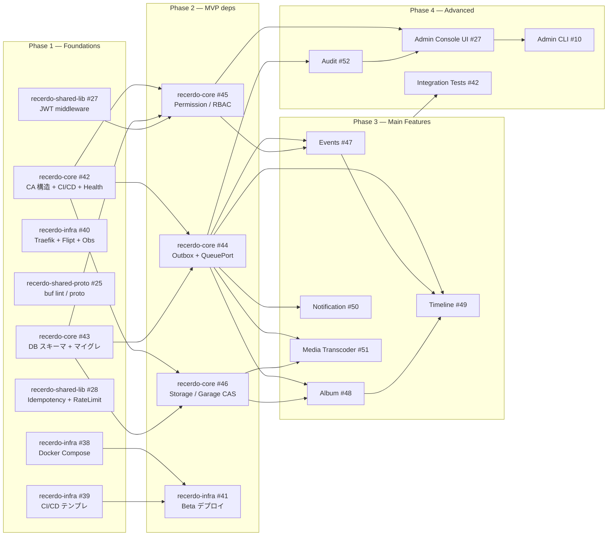

# タスク同期/非同期依存関係マトリクス + 開発着手順序ロードマップ

!!! note "この文書の目的"
    全マイクロサービス・全クライアントの実装タスクについて、**同期必須（先行タスク完了後に着手）** と **非同期可（並行実装可能）** の依存関係を整理し、開発着手順序を明確化する。
    バイブコーディング（LLM エージェントによる自律実装）のエージェントがこの依存関係を参照して自律的に着手順序を判断できるよう記述する。

**出典**: [`docs/core/workflow.md §3 Issue ライフサイクル`](workflow.md)、[`docs/core/poc-beta-scope.md §3 ロードマップ`](poc-beta-scope.md)

---

## Phase 別依存関係マトリクス

### Stage1-Phase1 Core（Beta M0 — Foundations）

全 Phase1 タスクは **相互に並行実施可能**（依存関係なし）。ただし、Phase 2 以降は Phase 1 が **全て完了** していることが前提。

| タスク | リポジトリ | Issue | 前提条件 | 並行可否 |
|---|---|---|---|---|
| Docker Compose 開発環境 | `recerdo-infra` | #38 | なし | ✅ 他と並行可 |
| CI/CD テンプレート整備 | `recerdo-infra` | #39 | なし | ✅ 他と並行可 |
| Traefik + Flipt + Observability | `recerdo-infra` | #40 | なし | ✅ 他と並行可 |
| buf lint / proto 構造定義 | `recerdo-shared-proto` | #25 | なし | ✅ 他と並行可 |
| JWT ミドルウェア + shared-lib bootstrap | `recerdo-shared-lib` | #27 | なし | ✅ 他と並行可 |
| Idempotency + Rate Limit ミドルウェア | `recerdo-shared-lib` | #28 | なし | ✅ 他と並行可 |
| CA 構造 + CI/CD + Health Endpoint | `recerdo-core` | #42 | なし | ✅ 他と並行可 |
| DB スキーマ + マイグレーション | `recerdo-core` | #43 | なし | ✅ 他と並行可 |
| iOS Bootstrap + Cognito | `recerdo-ios` | #11 | なし | ✅ 他と並行可 |
| Kotlin Android Bootstrap + Cognito | `recerdo-android-dart` | #2 | なし | ✅ 他と並行可 |
| SPA Bootstrap + Cognito | `recerdo-spa-webclient` | #2 | なし | ✅ 他と並行可 |
| Electron Bootstrap | `recerdo-desktop-electron` | #2 | なし | ✅ 他と並行可 |

### Stage1-Phase2 Base（Beta M1 — MVP 依存）

**前提**: Phase 1 が全て完了していること。

| タスク | リポジトリ | Issue | 同期前提（必須） | 非同期可（並行可） |
|---|---|---|---|---|
| Outbox Publisher + Queue Port | `recerdo-core` | #44 | #42 #43（CA 構造 + DB） | #25（proto）は並行可 |
| Permission Service（RBAC） | `recerdo-core` | #45 | #42 #43 #27（JWT middleware） | #44 と並行可 |
| Storage Service（Garage CAS） | `recerdo-core` | #46 | #42 #43 | #44 #45 と並行可 |
| Beta デプロイパイプライン | `recerdo-infra` | #41 | #38 #39（CI/CD 環境） | #44 #45 #46 と並行可 |

### Stage1-Phase3 Features（Beta M1/M2 — Main Features）

**前提**: Phase 2 が完了していること（特に #44 Outbox Publisher）。

| タスク | リポジトリ | Issue | 同期前提（必須） | 非同期可（並行可） |
|---|---|---|---|---|
| Events Service | `recerdo-core` | #47 | #44（Outbox）#45（RBAC） | #46 #48 #49 と並行可 |
| Album Service | `recerdo-core` | #48 | #44（Outbox）#46（Storage） | #47 #49 と並行可 |
| Timeline Service | `recerdo-core` | #49 | #44（Outbox）+ #47/#48 の Saga イベント定義 | #48 と並行可（イベント定義後） |
| Notification Service | `recerdo-core` | #50 | #44（Outbox） | #47 #48 #49 と並行可 |
| Media Transcoder（HLS / HEIC） | `recerdo-core` | #51 | #46（Storage）#44（Outbox） | #47 #48 と並行可 |

### Stage1-Phase4 Advanced（Beta M2/M3）

**前提**: Phase 3 が完了していること。

| タスク | リポジトリ | Issue | 同期前提 | 非同期可 |
|---|---|---|---|---|
| Audit Service | `recerdo-core` | #52 | #44（Outbox）+ 全サービスの監査イベント定義 | 他と並行可 |
| Admin Console UI | `recerdo-admin-system` | #27 | #45（Permission/RBAC）#52（Audit） | 他と並行可 |
| Admin CLI | `recerdo-admin-cli` | #10 | #27（Admin Console API） | 他と並行可 |
| Integration Test Suite | `recerdo-infra` | #42 | 全 Phase 3 完了後 | k6 スクリプトは並行可 |
| OCI 移行（Terraform） | `recerdo-infra` | 別途 | Phase 4 完了後 | — |

---

## 依存関係グラフ

---

## 開発推奨順序（Scrum Sprint 想定）

### Sprint 1 — Beta M0, Week 1–2

全 Phase 1 タスクを並行実施（開発者を機能領域でアサイン）。

- インフラ担当: `recerdo-infra` #38, #39, #40
- バックエンド担当 A: `recerdo-shared-proto` #25、`recerdo-shared-lib` #27, #28
- バックエンド担当 B: `recerdo-core` #42, #43
- フロント担当: `recerdo-ios` #11、`recerdo-android-dart` #2、`recerdo-spa-webclient` #2

### Sprint 2 — Beta M1, Week 3–4

Phase 2 タスクを並行実施（Phase 1 完了が前提）。

- バックエンド担当 A: `recerdo-core` #44（Outbox）、#45（Permission）
- バックエンド担当 B: `recerdo-core` #46（Storage）
- インフラ担当: `recerdo-infra` #41（Beta デプロイ）

### Sprint 3 — Beta M1/M2, Week 5–7

Phase 3 タスクを依存関係に従って実施。

- `#47` (Events) と `#48` (Album) は並行実施可
- `#49` (Timeline) は `#47` / `#48` の Saga イベント定義後に着手
- `#50` (Notification) と `#51` (Media Transcoder) は並行実施可

---

## LLM エージェント向け判断ルール

AI エージェントがこの文書を参照して自律的にタスクを選ぶ場合、以下を順に適用する。

1. **Phase の優先**: 現在着手可能な最も若い Phase の Issue を選ぶ。Phase n+1 の Issue は Phase n の Issue が **全て** 完了するまで着手しない。
2. **同期前提の確認**: Issue の「同期前提（必須）」欄に挙がる Issue が全て `status:done` であることを確認する。未完了がある場合は着手しない。
3. **非同期可の活用**: 同一 Phase 内で「非同期可」と書かれた Issue は並行実施可能。複数エージェントで分担する際の分割軸に使う。
4. **`security:review` ラベル付き Issue の扱い**: AI によるコード生成は禁止（`poc-beta-scope.md §1.2`）。該当 Issue は人間が実装する。
5. **依存関係の双方向性**: ある Issue が別 Issue の前提である場合、そのことを両 Issue の本文に `Linked Issues` として明記する。

---

## メンテナンス

- 新しい Phase の Issue が追加された場合、本文書のマトリクスに追記する。
- Issue の優先順位・依存関係が変わった場合、`docs/core/sprints/` 配下のスプリント報告と併せて更新する。
- Phase 進行に応じて `status:done` の Issue はマトリクスから削除せず、履歴として残す（完了年月日を付記）。

---

## 参考文献

- [開発ワークフロー §2 Milestone / Sprint 運用](workflow.md)
- [PoC/Beta スコープ §3 実装ロードマップ](poc-beta-scope.md)
- [ADR-0001 命名規約](adr/0001-naming-convention.md)
- [ADR-0002 リポレイアウト（per-service）](adr/0002-repo-layout-per-service.md)
