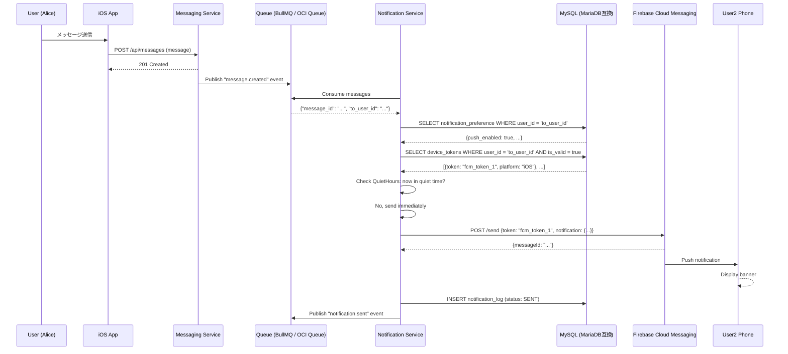
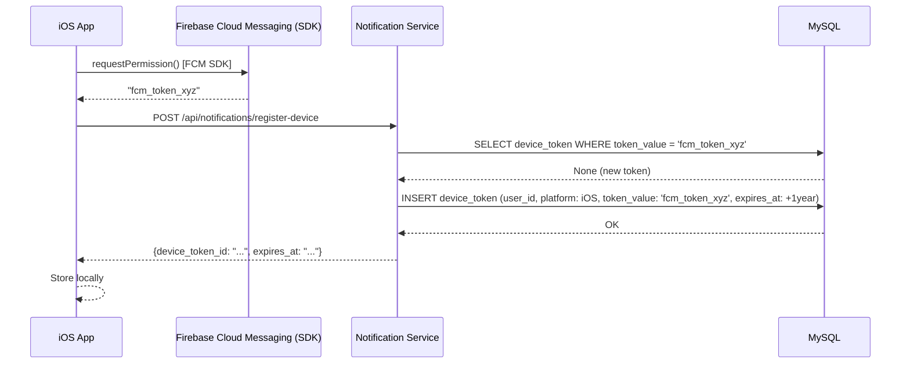
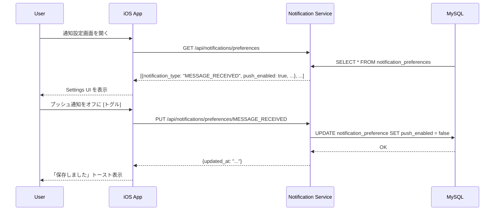

# プッシュ通知機能仕様書

**作成者**: Claude (AI) · **作成日**: 2026-04-15 · **ステータス**: 提案 (Proposal)

---

## 1. 概要

プッシュ通知は、Recuerdoアプリケーションでユーザーがオンラインでない場合にも、重要なイベント（メッセージ受信、思い出シェア、コメント追加など）をリアルタイムで通知する機能。Firebase Cloud Messaging (FCM) を**主軸**として、iOS および Android デバイスへの配信をサポート。ユーザー設定に基づいた配信制御、オフライン対応、再試行メカニズムをサポートする。

!!! note "FCM-primary 方針"
    通知チャネルは FCM（プッシュ）および IN_APP（アプリ内）を基本とする。メール通知は、セキュリティ関連通知・FCMトークン未登録ユーザー・法的通知・ユーザーがオプトインした週次ダイジェストなど特定条件下のみで使用する。メール送信基盤は **Postfix + Dovecot + Rspamd on CoreServerV2 CORE+X**（自前SMTP）を採用し、AWS SES / SNS は利用しない。詳細は [Notification Service DD](../../microservice/notifications-svc.md) を参照。

## 2. ユースケース詳細

### 2.1 UC1: ユーザーがメッセージを受け取る

**Who**: 旧友または仲良かったグループのメンバー

**What**: Messaging Service がメッセージを作成・保存した直後に、受信者へのプッシュ通知をトリガー

**When**: メッセージ送信時（同期的に Messaging Service がイベント発行）

**Where**: Notification Service がキュー経由でイベントを受信（Beta: Redis+BullMQ / 本番: OCI Queue）

**Why**: ユーザーがアプリを開いていなくても、新しいメッセージの到着を認識できるようにする

**How**: 
1. Messaging Service が `message.created` イベントをキューに発行
2. Notification Service がキューをコンシューム、イベント受信
3. `NotificationType.MESSAGE_RECEIVED` として処理
4. 受信者の DeviceToken（全デバイス）を取得
5. 各デバイスの NotificationPreference をチェック（push_enabled = true?）
6. FCM API を呼び出し、プッシュ通知を配信
7. 配信ログを記録

**データ例**:
```json
{
  "notification_id": "notif-uuid-1",
  "user_id": "user-receiver-123",
  "title": "新しいメッセージ",
  "body": "Alice: こんにちは。元気ですか？",
  "notification_type": "MESSAGE_RECEIVED",
  "delivery_channels": ["PUSH", "IN_APP"],
  "priority": "HIGH",
  "data": {
    "sender_id": "user-alice-456",
    "message_id": "msg-uuid-999",
    "thread_id": "thread-uuid-888"
  }
}
```

### 2.2 UC2: ユーザーがアルバム内で思い出をシェア

**Who**: グループ所有者またはメンバー

**What**: アルバムで思い出（写真/ビデオ）をシェアした時、該当ユーザーへプッシュ通知

**When**: Album Service で share リクエスト成功時

**How**:
1. Album Service が `memory.shared` イベントをキュー（Beta: BullMQ / 本番: OCI Queue）へ発行
2. Notification Service が受信、`NotificationType.MEMORY_SHARED` として処理
3. シェア対象ユーザーの DeviceToken を取得
4. FCM でプッシュ配信

### 2.3 UC3: ユーザーがプッシュ通知設定を変更

**Who**: アプリユーザー

**What**: 設定画面で「メッセージ通知をオン/オフ」、「静穏時間帯を設定」

**When**: ユーザーが設定画面で変更送信時

**How**:
1. iOSアプリが `PUT /api/notifications/preferences/{notification_type}` を呼び出し
2. Notification Service が NotificationPreference レコード更新
3. 次回からの通知配信がユーザー設定を尊重

**設定形式**:
```json
{
  "notification_type": "MESSAGE_RECEIVED",
  "push_enabled": true,
  "email_frequency": "DAILY",
  "in_app_enabled": true,
  "quiet_hours_start": 22,  // 夜10時
  "quiet_hours_end": 8      // 朝8時
}
```

### 2.4 UC4: オフラインユーザーが再度ログイン時に未配信通知を表示

**Who**: オフラインだったユーザー

**What**: ログイン時に、オフライン中に受け取るべきだった通知をアプリ内インボックスで表示

**When**: ユーザーログイン直後

**How**:
1. Auth Service が ログイン成功イベント発行
2. Notification Service が `GET /api/notifications?unread=true` リクエストに応答
3. ユーザーの未読通知一覧（IN_APP チャネル）を返す
4. iOSアプリが通知バナーまたは専用画面で表示

## 3. 通知種別と優先度マトリックス

| 通知種別             | 説明                     | 推奨優先度 | デフォルト配信チャネル  | メール（Postfix SMTP）利用条件 | ユーザー設定可能 |
| -------------------- | ------------------------ | ---------- | ----------------------- | ------------------------------ | ---------------- |
| MESSAGE_RECEIVED     | メッセージ受信           | HIGH       | PUSH, IN_APP            | FCMトークン未登録時のみ        | ✓                |
| GROUP_CREATED        | グループ作成された       | NORMAL     | PUSH, IN_APP            | FCMトークン未登録時のみ        | ✓                |
| MEMORY_SHARED        | 思い出がシェアされた     | NORMAL     | PUSH, IN_APP            | FCMトークン未登録時のみ        | ✓                |
| MEMORY_LIKED         | 思い出が「いいね」された | LOW        | IN_APP                  | 不使用                         | ✓                |
| COMMENT_ADDED        | コメント追加             | NORMAL     | PUSH, IN_APP            | FCMトークン未登録時のみ        | ✓                |
| FRIEND_ADDED         | 友人追加されました       | LOW        | IN_APP                  | 不使用                         | △（固定）        |
| USER_MENTIONED       | メンション               | HIGH       | PUSH, IN_APP            | FCM3回失敗フォールバック       | ✓                |
| SECURITY_ALERT       | セキュリティ通知         | HIGH       | PUSH, IN_APP, **EMAIL** | **必須**（FCM状態問わず送信）  | ✗（固定）        |
| ACCOUNT_VERIFICATION | メールアドレス確認       | HIGH       | **EMAIL**               | **必須**                       | ✗（固定）        |
| LEGAL_NOTICE         | 規約・ポリシー変更       | NORMAL     | IN_APP, **EMAIL**       | **必須**（証跡確保のため）     | ✗（固定）        |

**優先度の意味**:
- **HIGH**: 即座に配信。静穏時間帯も配信。バッファリングなし
- **NORMAL**: 通常配信。静穏時間帯は保留
- **LOW**: まとめて配信。1時間以内に最大1回

## 4. 通知設定UI

### 4.1 設定画面（iOSアプリ）

```
┌─────────────────────────────────┐
│  通知設定                        │
├─────────────────────────────────┤
│ メッセージ通知                   │
│  ☑ プッシュ通知を受け取る        │
│  ○ メール頻度: 毎日 ▼            │
│                                 │
│ 思い出シェア通知                  │
│  ☑ プッシュ通知を受け取る        │
│  ○ メール頻度: 毎週 ▼            │
│                                 │
│ 「いいね」通知                   │
│  ☑ プッシュ通知を受け取る        │
│  ○ メール頻度: なし ▼            │
│                                 │
│ 静穏時間帯                       │
│  ☑ 有効にする                    │
│  開始: 22:00 ▼                  │
│  終了: 08:00 ▼                  │
│                                 │
│           [保存]                │
└─────────────────────────────────┘
```

### 4.2 REST API エンドポイント

```
PUT /api/notifications/preferences/{notification_type}
Content-Type: application/json

{
  "push_enabled": true,
  "email_frequency": "DAILY",
  "in_app_enabled": true,
  "quiet_hours_start": 22,
  "quiet_hours_end": 8
}

Response (200 OK):
{
  "preference_id": "pref-uuid",
  "user_id": "user-uuid",
  "notification_type": "MESSAGE_RECEIVED",
  "push_enabled": true,
  "email_frequency": "DAILY",
  "in_app_enabled": true,
  "quiet_hours_start": 22,
  "quiet_hours_end": 8,
  "updated_at": "2026-04-15T10:30:00Z"
}
```

```
GET /api/notifications/preferences
Response (200 OK):
{
  "preferences": [
    {
      "notification_type": "MESSAGE_RECEIVED",
      "push_enabled": true,
      "email_frequency": "DAILY",
      "in_app_enabled": true
    },
    ...
  ]
}
```

## 5. オフライン対応

### 5.1 設計

オフラインユーザーへの通知は、**IN_APP** チャネルに自動的に保存される。ユーザーが再度ログインした時、アプリが `GET /api/notifications?unread=true` を呼び出してオフライン中の通知を取得・表示する。

### 5.2 フロー

```
ユーザーがオンライン時:
  メッセージ受信
    → Notification Service が FCM で PUSH 配信
    → IN_APP にも記録

ユーザーがオフライン時:
  メッセージ受信
    → Notification Service が PUSH 試行（失敗）
    → IN_APP に記録（自動）
    → Redis キャッシュに「未配信」フラグ

ユーザーが再度ログイン:
  → iOSアプリが GET /api/notifications?unread=true 呼び出し
  → Notification Service が IN_APP テーブルから未読通知取得
  → アプリが通知バナーまたは「通知」タブで表示
  → ユーザーが読むと MarkAsRead API で既読化
```

### 5.3 IN_APP チャネルのデータ保持

- **保持期間**: 30日（自動削除）
- **未読マーク**: `is_read = false` フラグで管理
- **ユーザーは削除可能**: DELETE /api/notifications/{notification_id}

## 6. シーケンス図（Mermaid）

### 6.1 メッセージ受信 → プッシュ通知フロー



### 6.2 デバイストークン登録フロー



### 6.3 通知設定更新フロー



## 7. エラーハンドリング・リトライ戦略

### 7.1 配信失敗時の処理

```
1回目の配信試行
  └─ FCM エラー: 無効トークン (401)
      → DeviceToken.is_valid = false に更新
      → 再試行なし

  └─ FCM エラー: 一時的エラー (500)
      → 通知ログに retry_count = 1 で記録
      → キューの DLQ に移動（BullMQ failed queue / OCI Queue DLQ）
      → 5分後に再試行

2回目の配信試行
  └─ 再度失敗
      → retry_count = 2
      → DLQ 再キュー
      → 10分後に再試行

3回目の配信試行
  └─ 再度失敗
      → retry_count = 3
      → 通知ステータス = FAILED
      → 管理者にアラート（Prometheus + Loki）
```

### 7.2 重複排除メカニズム

```
Key: "notification:dedup:{user_id}:{notification_type}"
Value: last_sent_timestamp
TTL: 24 hours

新しい通知が到着:
  1. Redis から dedup キーを取得
  2. 存在かつ 24h以内 → 重複として DROP
  3. 存在しない → 処理継続、dedup キーに記録
```

## 8. パフォーマンス・スケーラビリティ

### 8.1 予測されるトラフィック

- **月間アクティブユーザー**: 100K
- **ユーザーあたり平均通知数**: 10/月
- **ピークタイム**: 朝8時～9時（ビジネスアワー）
- **予想 TPS (notification/sec)**: (100K × 10) / (30 × 24 × 3600) ≈ 0.4 TPS

### 8.2 スケーリング戦略

- **キュー**: Beta は Redis+BullMQ、本番は OCI Queue。複数ワーカーでコンシューム
- **FCM**: バッチ API 活用（最大500デバイス/リクエスト）
- **MySQL（MariaDB互換）**: notification_log テーブルにパーティショニング（日次）
- **Redis**: Beta は自前 Redis、本番は OCI Cache with Redis。Notification Service インスタンス間の同期に利用

## 9. セキュリティ・プライバシー

### 9.1 データ保護

- FCM トークンは暗号化してDB保存
- API 認証: JWT（Authentication Service から発行）
- SSL/TLS: API エンドポイント全て HTTPS

### 9.2 プライバシー

- 通知本文はユーザーに表示される情報のみ（個人情報含まない）
- デバイストークンは変更可能、削除可能
- 通知ログ（配信履歴）は90日後に自動削除

## 10. テスト計画

### 10.1 単体テスト

- NotificationType バリデーション
- QuietHours 判定ロジック
- 重複排除ロジック

### 10.2 統合テスト

- Queue → Notification Service → FCM フロー
- DeviceToken 有効性チェック
- NotificationPreference 適用
- Postfix SMTP 経由のメール配信（コンテナ化したテスト用 MTA）

### 10.3 E2E テスト

- 実デバイス（iOS Simulator）でのプッシュ通知受信確認
- オフラインから復帰後の通知表示確認
- デバイストークン失効時のフォールバック

## 11. 監視・運用

### 11.1 メトリクス（Prometheus + Loki）

- `notification_sent_total` (count/min)
- `notification_failed_total` (count/min)
- `fcm_request_duration_seconds` (histogram)
- `queue_pending_jobs` / `queue_dlq_jobs`（BullMQ / OCI Queue）

### 11.2 アラート

- FCM エラー率が 5% 超過時
- キュー DLQ メッセージ蓄積時
- DB 接続数が上限 80% 超過時

## 12. 将来の拡張

- SMS 通知チャネル追加
- Webhook ベースの通知ルーティング
- A/B テスト（配信時刻・メッセージテンプレート最適化）
- ML ベースの最適配信時間予測

---

最終更新: 2026-04-19 ポリシー適用
