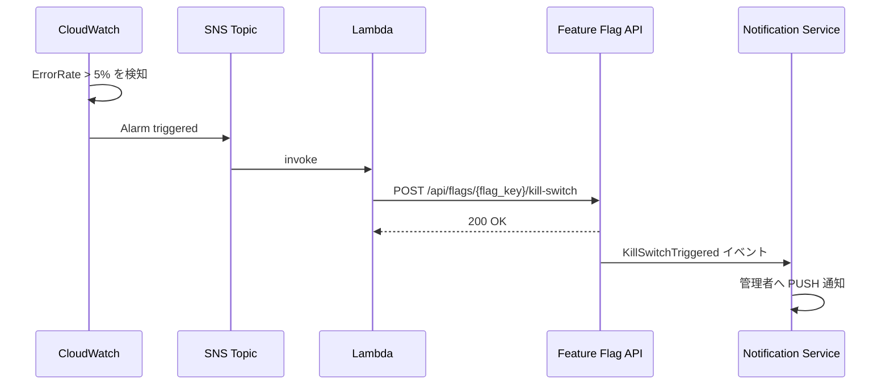

# Feature Flag 機能仕様書

**作成者**: Claude (AI) · **作成日**: 2026-04-19 · **ステータス**: 承認済み (Approved)

> Notion レビューコメント: 「この内容で設計を実施したいと思います。」(2026-04-18)

---

## 1. 概要

Feature Flag（機能フラグ）は、Recerdo の全マイクロサービスで新機能の公開を制御する横断的機能。コードデプロイなしで機能を ON/OFF でき、段階的なロールアウト・緊急停止・IP制限を実現する。

**採用スタック**: OpenFeature SDK（CNCF標準）+ Flipt（OSS、無料）

## 2. ユースケース詳細

### 2.1 UC1: 新機能を段階的に公開する（Percentage Rollout）

**Who**: 開発者 / 機能オーナー

**What**: 新機能を全ユーザーではなく、10%のユーザーから始めて段階的に拡大して公開する

**When**: 新機能のリリース時

**How**:
1. 管理者が Flipt ダッシュボードまたは Admin API でフラグを作成
   ```
   POST /api/flags
   { "flag_key": "feature.album.collaborative_edit", "name": "アルバム共同編集", "enabled": true }
   ```
2. Percentage Rollout ルールを設定（最初は10%）
   ```
   PUT /api/flags/feature.album.collaborative_edit/rules/rollout
   { "percentage": 10 }
   ```
3. アルバムサービスは機能実行前にフラグ評価
   ```go
   enabled, _ := featureFlagClient.BooleanValue(ctx, "feature.album.collaborative_edit", false, evalCtx)
   if enabled {
       // 新機能のコードパス
   }
   ```
4. 問題なければ段階的に 10% → 50% → 100% に拡大

**データ例**:
```json
{
  "flag_key": "feature.album.collaborative_edit",
  "enabled": true,
  "rules": [
    {
      "rule_type": "PERCENTAGE",
      "config": { "percentage": 10 },
      "priority": 1
    }
  ]
}
```

### 2.2 UC2: 障害発生時に機能を即座に停止する（Kill Switch）

**Who**: 運用担当者 / 管理者

**What**: 特定機能のエラー率が急増した時、コードデプロイなしで即座に機能を無効化する

**When**: エラー率が閾値（例: 5%）を超えた時

**How（手動）**:
1. 管理者が Flipt ダッシュボードまたは API で Kill Switch を発動
   ```
   POST /api/flags/feature.album.collaborative_edit/kill-switch
   { "reason": "MANUAL", "triggered_by": "admin@recerdo.jp" }
   ```
2. FeatureFlag.enabled = false に更新
3. Redis キャッシュが即座に無効化（60秒以内に全インスタンスへ波及）
4. 管理者へ通知（Notification Service 経由）

**How（自動）**:
```
CloudWatch: ErrorRate > 5% を検知
    → CloudWatch Alarm が SNS へ通知
    → Lambda が起動
    → POST /api/flags/{flag_key}/kill-switch { reason: "AUTO_KILLSWITCH" }
    → フラグが自動停止
    → Slack/管理者プッシュ通知
```

### 2.3 UC3: 社内チームのみに機能を公開する（IP制限）

**Who**: 開発者

**What**: 本番環境でオフィスの IPアドレス範囲からのみ新機能にアクセスできるようにする

**When**: 機能の社内限定テスト期間中

**How**:
1. IP制限ルールを設定
   ```
   PUT /api/flags/feature.timeline.v2/rules/ip
   { "cidr_ranges": ["203.0.113.0/24"], "logic": "OR" }
   ```
2. EvaluationContext に ip_address を含めて評価
3. 社内IPからのリクエストのみフラグが `true` になる

### 2.4 UC4: フラグの状態と統計を確認する

**Who**: 機能オーナー / 管理者

**What**: フラグの現在の ON/OFF 状態、適用ルール、評価統計（何人に適用されているか）を確認する

**When**: リリース進捗確認・障害調査時

**How**:
1. `GET /api/flags/feature.album.collaborative_edit` でフラグ詳細取得
2. Flipt ダッシュボードでリアルタイム評価メトリクスを確認
3. `GET /api/flags/feature.album.collaborative_edit/audit` で変更履歴を確認

## 3. フラグ命名規則

フラグキーは以下の命名規則に従う:

```
{scope}.{service/domain}.{feature_name}

例:
feature.album.collaborative_edit     # アルバムサービスの共同編集
feature.timeline.v2                  # タイムライン V2
feature.messaging.group_reactions    # グループリアクション機能
maintenance.events_svc.read_only     # メンテナンスモード（Events Service）
experiment.notifications.digest_v2  # A/Bテスト実験
```

## 4. フラグの種別

| フラグ種別 | 説明 | ユースケース |
| --- | --- | --- |
| **Boolean** | ON/OFF の2値 | 通常の機能フラグ、Kill Switch |
| **Variant** | 複数値（文字列/JSON） | A/Bテスト、設定値の切り替え |

現フェーズでは Boolean フラグのみを利用する。

## 5. フラグ評価の優先度とロジック

フラグ評価は以下の順序で実行される:

```
1. フラグが enabled=false → 即座に false を返す

2. FlagRule を priority 順（低い値が優先）に評価:
   priority 1: IP_RANGE ルール → マッチすれば true/false
   priority 2: SEGMENT ルール → マッチすれば true/false
   priority 3: PERCENTAGE ルール → マッチすれば true/false
   priority 99: ALWAYS ルール → 全員 true

3. マッチするルールがない → フラグデフォルト値（enabled）を返す
```

## 6. フェイルセーフ設計

Flipt サーバーや Redis への接続が失敗した場合、フラグごとに定義された `fail_mode` に従って動作する:

| fail_mode | 動作 | 用途 |
| --- | --- | --- |
| `CLOSE`（デフォルト） | false を返す | 安全側に倒す（新機能は公開しない） |
| `OPEN` | true を返す | サービス継続が優先（既存機能の維持） |

> **原則**: 新機能フラグは `CLOSE`、既存機能の維持目的のフラグは `OPEN` を設定する。

## 7. 各マイクロサービスでの利用方法

各マイクロサービスは OpenFeature SDK（Go）を通してフラグを評価する。Flipt への直接接続は行わない。

```go
// 初期化（各サービスの main.go で一度だけ）
import (
    "github.com/open-feature/go-sdk/openfeature"
    fliptProvider "github.com/open-feature/go-sdk-contrib/providers/flipt/pkg/provider"
)

func initFeatureFlags() {
    provider := fliptProvider.NewProvider(
        fliptProvider.WithAddress(os.Getenv("FLIPT_ADDRESS")),
    )
    openfeature.SetProvider(provider)
}

// 機能フラグの評価（各ハンドラー/ユースケースで利用）
func (h *AlbumHandler) CreateCollaborativeAlbum(ctx context.Context, req *Request) (*Response, error) {
    client := openfeature.NewClient("album-svc")
    enabled, err := client.BooleanValue(ctx, "feature.album.collaborative_edit", false,
        openfeature.NewEvaluationContext(req.UserID, map[string]interface{}{
            "org_id":     req.OrgID,
            "ip_address": req.IPAddress,
        }),
    )
    if err != nil || !enabled {
        return nil, ErrFeatureNotAvailable
    }
    // 機能実行
    return h.usecase.CreateCollaborativeAlbum(ctx, req)
}
```

## 8. 監視・運用

### 8.1 Flipt メトリクス（Prometheus）

Flipt が内蔵するメトリクスを CloudWatch に転送:

- `flipt_evaluations_requests_total` — フラグ評価リクエスト数
- `flipt_evaluations_error_total` — 評価エラー数

### 8.2 Kill Switch 自動化フロー



### 8.3 変更管理

- 全フラグ変更は `FlagAuditLog` に記録（変更者、日時、変更前後の値）
- `GET /api/flags/{flag_key}/audit` で変更履歴を確認可能
- 本番環境のフラグ変更は Slack #ops-alerts チャンネルへの自動通知が必須

## 9. フラグライフサイクル

```
作成 (enabled=false)
    ↓
社内テスト（IP制限 or Segment）
    ↓
段階的ロールアウト（5% → 20% → 50% → 100%）
    ↓
全ユーザー公開（ALWAYS ルール or enabled=true のみ）
    ↓
フラグ削除（コードから評価を削除してからフラグを削除）
```

> **重要**: フラグが不要になった後、コードから評価コードを削除せずにフラグだけを削除するとエラーが発生する。必ずコード側の削除を先に行い、PR レビューで確認すること。
