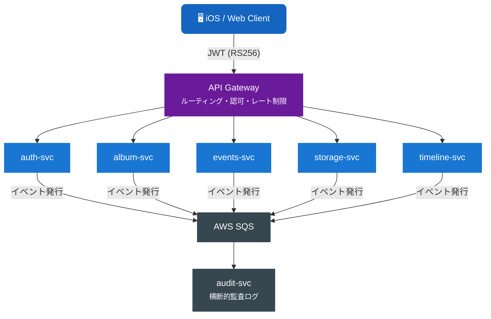

# Recerdo Developer Docs

**Recerdo** は旧友・仲良かったグループとの思い出を共有するソーシャルメディアアプリ（Viejo）です。  
このサイトでは、APIリファレンス・マイクロサービス設計・クリーンアーキテクチャ設計を一元管理します。

---

-   :material-api: **API ドキュメント**

    ---

    各サービスが公開するREST APIのエンドポイント・リクエスト/レスポンス仕様一覧。

    [:octicons-arrow-right-24: APIドキュメントを見る](api/index.md)

-   :material-server-network: **マイクロサービス設計**

    ---

    ドメインモデル・ユースケース・インフラ設計などのDD（Design Document）。

    [:octicons-arrow-right-24: マイクロサービス設計を見る](microservice/index.md)

-   :material-layers-triple: **クリーンアーキテクチャ設計**

    ---

    レイヤーアーキテクチャ・依存性設計・テスト戦略の詳細設計書。

    [:octicons-arrow-right-24: CA設計を見る](clean-architecture/index.md)

-   :material-feature-search-outline: **機能仕様**

    ---

    機能レベルの詳細設計書。ユースケース・シーケンス図・API設計を含む。

    [:octicons-arrow-right-24: 機能仕様を見る](features/index.md)

---

## アーキテクチャ概要

## サービス一覧

| サービス | リポジトリ | 役割 |
|---------|---------|------|
| API Gateway | recuerdo-api-gateway | ルーティング・認可 |
| Auth Service | recuerdo-auth-svc | 認証・JWT・セッション |
| Events Service | recuerdo-events-svc | イベント・招待 |
| Album Service | recuerdo-album-svc | アルバム・写真 |
| Storage Service | recuerdo-storage-svc | メディアファイル |
| Timeline Service | recuerdo-timeline-svc | フィード・タイムライン |
| Audit Service | recuerdo-audit-svc | 監査ログ（横断的） |

---

> **ステータス**: Draft — 2026年4月現在、設計フェーズ
