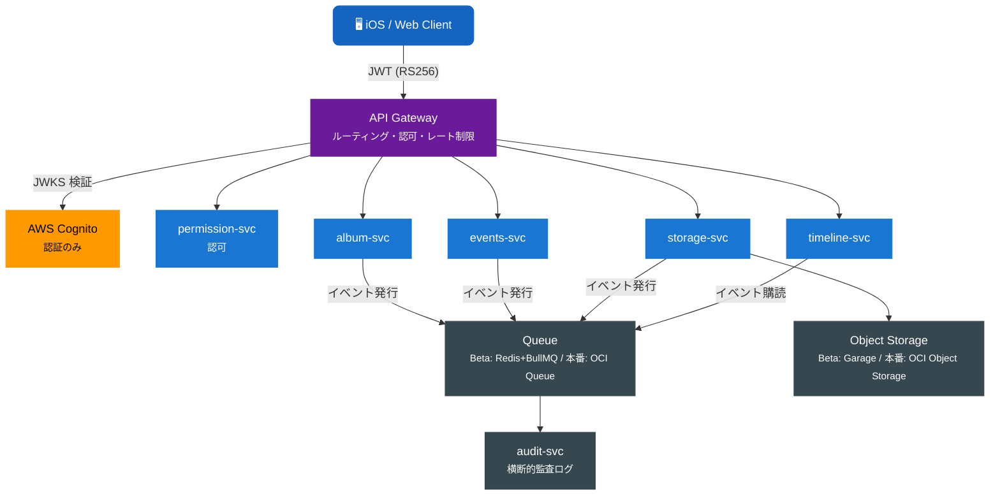

# Recerdo Developer Docs

**Recerdo** は旧友・仲良かったグループとの思い出を共有するソーシャルメディアアプリ（Viejo）です。  
このサイトでは、APIリファレンス・マイクロサービス設計・クリーンアーキテクチャ設計を一元管理します。

---

-   :material-api: **API ドキュメント**

    ---

    各サービスが公開するREST APIのエンドポイント・リクエスト/レスポンス仕様一覧。

    [:octicons-arrow-right-24: APIドキュメントを見る](api/index.md)

-   :material-server-network: **マイクロサービス設計**

    ---

    ドメインモデル・ユースケース・インフラ設計などのDD（Design Document）。

    [:octicons-arrow-right-24: マイクロサービス設計を見る](microservice/index.md)

-   :material-layers-triple: **クリーンアーキテクチャ設計**

    ---

    レイヤーアーキテクチャ・依存性設計・テスト戦略の詳細設計書。

    [:octicons-arrow-right-24: CA設計を見る](clean-architecture/index.md)

-   :material-feature-search-outline: **機能仕様**

    ---

    機能レベルの詳細設計書。ユースケース・シーケンス図・API設計を含む。

    [:octicons-arrow-right-24: 機能仕様を見る](features/index.md)

---

## インフラ・運用ポリシー（2026-04-19 適用）

- **AWS は Cognito のみ利用**（認証のみ）。他のAWSサービスはOSS/OCIに置き換え。
- **Beta**: XServer VPS（6 core / 10 GB RAM） + CoreServerV2 CORE+X（6 GB） / **Garage**（S3互換OSS） / **MySQL（MariaDB互換）** / **Redis + BullMQ・asynq** / **Postfix + Dovecot + Rspamd**。
- **本番は OCI ファースト**: OCI Object Storage / OCI MySQL HeatWave / OCI Queue Service / OCI Cache with Redis。メール基盤のみ CoreServerV2 CORE+X 継続。
- **Feature Flag**: Flipt。**ログ**: Loki。**プッシュ通知**: FCM。
- **メディア**: 動画は HLS（360/720/1080p・6秒セグメント）、HEIC は JPEG/WebP に自動変換、**Live Photo は画像+動画ペア保存**（Apple `asset_identifier` で関連付け）。
- **ハイライトビデオはユーザー指定のみ**（自動生成なし）。
- 設計思想: **Hexagonal / Feature Flag / 12-factor**。

## アーキテクチャ概要

## サービス一覧

| サービス | リポジトリ | 役割 |
|---------|---------|------|
| API Gateway | recerdo-api-gateway | ルーティング・Cognito JWKS 検証 |
| Auth Service (Deprecated) | recerdo-auth | AWS Cognito へ移行中 |
| Permission Service | recerdo-permission | 認可・ロール・組織権限 |
| Events Service | recerdo-events | イベント・招待 |
| Album Service | recerdo-album | アルバム・写真 |
| Storage Service | recerdo-storage | メディアファイル |
| Timeline Service | recerdo-timeline | フィード・タイムライン |
| Audit Service | recerdo-audit | 監査ログ（横断的） |

---

> **ステータス**: Draft — 2026年4月現在、設計フェーズ

---

最終更新: 2026-04-19 ポリシー適用
