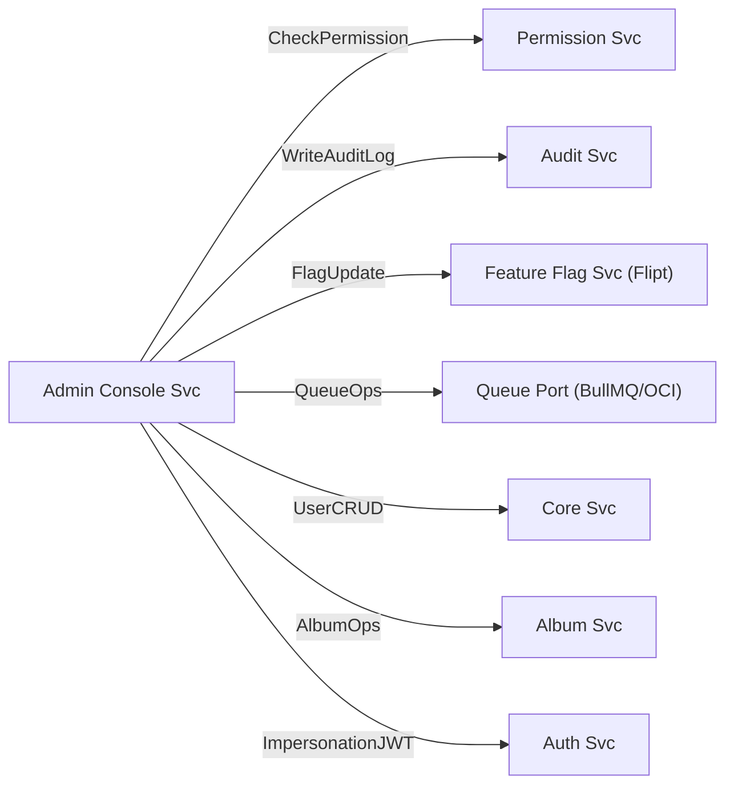
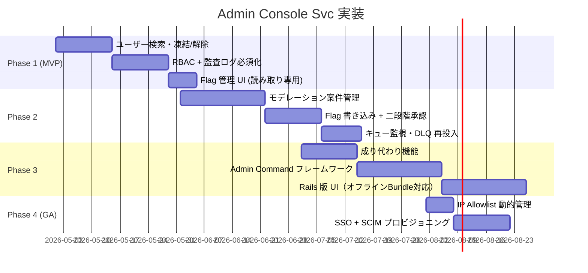

# Admin Console Service (recuerdo-admin-console-svc)

**作成者**: Claude (AI) · **作成日**: 2026-04-19 · **ステータス**: 承認待ち

> Notion レビューコメント（2026-04-18）: 「管理者コンソールにおける設計が行われていません。マイクロサービス・クリーンアーキテクチャベースで動作について検討してください。」

---

## 1. 概要

### 目的

Recerdo プラットフォームの **運用・監視・モデレーション・設定管理** を一元化する管理者向けマイクロサービス。カスタマーサポート、Trust & Safety、エンジニアリング、経営層それぞれに必要な運用インタフェースを RBAC に基づき提供する。

### 主要責務

1. **ユーザー・組織管理**: 検索、詳細表示、凍結、削除、権限変更
2. **モデレーション**: 通報処理、投稿・アルバム・イベントの可視性操作、直接ファイルアクセスと設定変更、NG ワード管理
3. **Feature Flag 管理 UI**: [Feature Flag Svc](feature-flag-system.md) の操作画面（Admin → Flipt 経由で更新）
4. **キュー監視 UI**: [Queue Abstraction](queue-abstraction.md) のメトリクス・DLQ 再投入
5. **監査ログビューア**: Audit Svc のログ検索・エクスポート
6. **コマンドキュー**: 長時間実行・バッチ系の「コマンド」を Admin が発行 → 非同期 Worker が実行
7. **システムヘルス**: 各マイクロサービスの死活、P95 レイテンシ、エラー率表示
  

### 非責務（別サービス担当）

- 認証・認可の発行（Auth Svc / Permission Svc が担当、Admin はクライアント）
- 実データの書き換え（各ドメイン Svc の API を呼び出す）
- ビジネス分析（Audit Svc + BI ツールで実施）

### ビジネスコンテキスト

解決する問題:
- CS 担当がユーザーからの問い合わせに対応する UI がない
- モデレーターが通報された投稿を処理する手段がない
- Feature Flag の切替を SRE がコマンドラインで実行しており、誤操作リスク・監査欠如
- Beta → 本番の切替オペレーションが手動で、二人確認が機械化されていない

Key User Stories:
- **CS 担当**として、ユーザー ID で検索し、アカウント状態（凍結/有効）を 1 クリックで変更したい
- **モデレーター**として、通報された投稿を一覧で見て、削除または "警告" を 1 アクションで付与したい
- **SRE**として、Feature Flag を切替える前に "Dry-Run"（影響ユーザー数表示）を確認したい
- **経営層**として、MAU・DAU・新規登録数をダッシュボードで毎朝確認したい
- **Trust & Safety 責任者**として、特定ユーザーの全行動履歴を 30 秒以内に取得したい

---

## 2. エンティティ層（ドメイン）

### 2.1 ドメインモデル

| エンティティ         | 説明                                          | 主要属性                                                                                                                                         |
| -------------------- | --------------------------------------------- | ------------------------------------------------------------------------------------------------------------------------------------------------ |
| AdminUser            | 管理者ユーザー（通常ユーザーとは分離）        | admin_id (UUID), email, role_id, mfa_enabled, last_login_at                                                                                      |
| AdminRole            | 管理者ロール                                  | role_id (UUID), name, description, scopes (array)                                                                                                |
| AdminAction          | 実行された管理者操作の監査記録                | action_id (UUID), admin_id, action_type, target_type, target_id, payload (JSON), result, executed_at                                             |
| ModerationCase       | モデレーション案件                            | case_id (UUID), reported_entity_type, reported_entity_id, reporter_ids (array), status (OPEN/RESOLVED/REJECTED), assigned_to, priority           |
| ModerationDecision   | モデレーター判定                              | decision_id (UUID), case_id, admin_id, verdict (REMOVE/WARN/KEEP), reason, decided_at                                                            |
| AdminCommand         | 非同期コマンド投入記録                        | command_id (UUID), admin_id, command_type, params (JSON), status (QUEUED/RUNNING/COMPLETED/FAILED), enqueued_at, started_at, finished_at, result |
| ApprovalRequest      | 二段階承認要求                                | request_id (UUID), requester_id, target_action, payload (JSON), approver_id, status (PENDING/APPROVED/REJECTED), expires_at                      |
| ImpersonationSession | CS がユーザーに成り代わって調査するセッション | session_id (UUID), admin_id, target_user_id, reason, expires_at (max 1h), audit_ref                                                              |

### 2.2 値オブジェクト

| 値オブジェクト      | 説明                   | バリデーション                                                  |
| ------------------- | ---------------------- | --------------------------------------------------------------- |
| AdminScope          | 操作権限スコープ       | `domain:action` 形式（例: `users:suspend`, `flags:write`）      |
| Verdict             | モデレーション判定結果 | REMOVE / WARN / KEEP / ESCALATE                                 |
| CommandType         | 非同期コマンド種別     | enum: MIGRATE_USER / BULK_EMAIL / EXPORT_DATA / FLAG_ROLLOUT 等 |
| ImpersonationReason | 成り代わり理由         | 最低 30 文字、フリーテキスト必須                                |

### 2.3 ドメインルール / 不変条件

- `AdminUser` は Cognito の **別ユーザープール**（`recerdo-admin-pool`）で管理し、通常ユーザープールと完全分離する
- 権限変更・凍結・削除・フラグ書き込みなど **高リスクアクションは二段階承認必須**（`ApprovalRequest` を経由）
- 全 `AdminAction` は **同期的** に Audit Svc に送信し、DB コミットと同一トランザクション内で成功を保証
- `ImpersonationSession` は **最大 1 時間**、対象ユーザーの全 PII アクセスを Audit に記録
- `ModerationDecision` が `REMOVE` の場合、対象エンティティ所有者に通知を送信（Notification Svc 経由）

### 2.4 ドメインイベント

| イベント              | トリガー           | 主要ペイロード                        |
| --------------------- | ------------------ | ------------------------------------- |
| AdminActionExecuted   | 全管理者操作完了時 | admin_id, action_type, target, result |
| ModerationCaseOpened  | 通報キューに追加   | case_id, entity, reporter_count       |
| ModerationDecided     | 判定完了           | case_id, verdict, reason              |
| AdminCommandEnqueued  | 非同期コマンド投入 | command_id, type, params_hash         |
| AdminCommandCompleted | 非同期コマンド完了 | command_id, status, duration_ms       |
| ApprovalRequested     | 二段階承認要求     | request_id, target_action, requester  |
| ApprovalGranted       | 承認完了           | request_id, approver                  |
| ImpersonationStarted  | 成り代わり開始     | admin_id, target_user_id, reason      |

---

## 3. ユースケース層（アプリケーション）

### 3.1 ユースケース一覧

| ユースケース          | 入力                                                        | 出力                                                | 説明                           |
| --------------------- | ----------------------------------------------------------- | --------------------------------------------------- | ------------------------------ |
| SearchUsers           | SearchUsersInput{query, filters, pagination}                | SearchUsersOutput{users[], total}                   | 管理対象ユーザーの検索         |
| SuspendUser           | SuspendUserInput{user_id, reason, duration_days}            | SuspendUserOutput{case_id}                          | ユーザー凍結（要承認）         |
| RestoreUser           | RestoreUserInput{user_id, reason}                           | RestoreUserOutput                                   | 凍結解除                       |
| MergeUsers            | MergeUsersInput{primary_id, secondary_id}                   | MergeUsersOutput{command_id}                        | 重複アカウント統合（非同期）   |
| ListModerationCases   | ListModerationCasesInput{status, priority, assignee}        | ListModerationCasesOutput{cases[]}                  | 案件一覧                       |
| DecideModerationCase  | DecideModerationCaseInput{case_id, verdict, reason}         | DecideModerationCaseOutput                          | 判定登録                       |
| UpdateFeatureFlag     | UpdateFeatureFlagInput{flag_key, changes, request_id?}      | UpdateFeatureFlagOutput{flipt_version}              | Flag 変更（要承認）            |
| TriggerKillSwitch     | TriggerKillSwitchInput{flag_key, reason}                    | TriggerKillSwitchOutput                             | 緊急停止（承認不要・監査必須） |
| ViewQueueDepth        | ViewQueueDepthInput{topic?}                                 | ViewQueueDepthOutput{depths[]}                      | キュー滞留状況                 |
| RedriveDLQ            | RedriveDLQInput{topic, job_ids[]}                           | RedriveDLQOutput{command_id}                        | DLQ 再投入                     |
| EnqueueAdminCommand   | EnqueueAdminCommandInput{type, params}                      | EnqueueAdminCommandOutput{command_id}               | 非同期コマンド投入             |
| GetAdminCommandStatus | GetAdminCommandStatusInput{command_id}                      | GetAdminCommandStatusOutput{status, result, logs}   | 進捗取得                       |
| StartImpersonation    | StartImpersonationInput{target_user_id, reason, ticket_ref} | StartImpersonationOutput{session_token, expires_at} | CS 成り代わり開始              |
| ExportAuditLog        | ExportAuditLogInput{filter, format}                         | ExportAuditLogOutput{command_id}                    | 監査ログエクスポート（非同期） |
| RequestApproval       | RequestApprovalInput{action, payload, approvers}            | RequestApprovalOutput{request_id}                   | 二段階承認起票                 |
| GrantApproval         | GrantApprovalInput{request_id, comment}                     | GrantApprovalOutput                                 | 承認実行                       |

### 3.2 横断制約（Invariants）

- 全 UseCase は **冒頭で Permission Svc に `CheckPermission` を問い合わせ**、スコープを検証する
- 副作用を伴う UseCase は **Audit Svc への記録が成功しなかった場合、操作をロールバック**
- `TriggerKillSwitch` を除き、**Write 系は Feature Flag `admin.readonly=true` でブロック可能**（緊急時の参照専用モード）

---

## 4. インタフェース層（API / UI）

### 4.1 API 仕様（抜粋）

| メソッド | パス                                    | 用途         | スコープ              |
| -------- | --------------------------------------- | ------------ | --------------------- |
| GET      | `/admin/v1/users`                       | ユーザー検索 | `users:read`          |
| POST     | `/admin/v1/users/:id/suspend`           | 凍結         | `users:suspend`       |
| POST     | `/admin/v1/users/:id/restore`           | 解除         | `users:suspend`       |
| GET      | `/admin/v1/moderation/cases`            | 案件一覧     | `moderation:read`     |
| POST     | `/admin/v1/moderation/cases/:id/decide` | 判定         | `moderation:write`    |
| GET      | `/admin/v1/flags`                       | Flag 一覧    | `flags:read`          |
| PATCH    | `/admin/v1/flags/:key`                  | Flag 更新    | `flags:write`         |
| POST     | `/admin/v1/flags/:key/killswitch`       | Kill Switch  | `flags:killswitch`    |
| GET      | `/admin/v1/queues`                      | キュー状況   | `infra:read`          |
| POST     | `/admin/v1/queues/:topic/redrive`       | DLQ 再投入   | `infra:write`         |
| POST     | `/admin/v1/commands`                    | コマンド投入 | `commands:execute`    |
| GET      | `/admin/v1/commands/:id`                | コマンド状況 | `commands:read`       |
| POST     | `/admin/v1/approvals`                   | 承認要求作成 | 自動                  |
| POST     | `/admin/v1/approvals/:id/grant`         | 承認         | `approvals:grant`     |
| POST     | `/admin/v1/impersonate`                 | 成り代わり   | `support:impersonate` |

### 4.2 フロントエンド（UI）

**二つの実装方針を並行維持**（Feature Flag `admin.frontend.stack` で切替）：

#### 方針 A: Next.js + shadcn/ui（主推奨・オンラインファースト）

- React 18 / Next.js 15 (App Router) / TypeScript
- shadcn/ui + Radix UI + Tailwind CSS
- tRPC または OpenAPI + React Query
- SSR で JWT 検証、クライアント側で細粒度の Permission チェック

#### 方針 B: Rails 8 + ActiveAdmin / Avo（オフライン耐性 + Sidekiq 親和）

- Ruby 3.3+ / Rails 8.x
- ActiveAdmin or Avo による DSL 型管理 UI
- Sidekiq Web ダッシュボードを同一アプリ内に統合
- **メリット**: 管理者が **ローカルで Rails Console 相当のコマンドをまとめて作成** → まとめてサーバーに送信できる "Command Bundle" 機能を実装しやすい

!!! tip "Rails 採用時のローカル→サーバーコマンド実行フロー"
    1. 管理者が **ローカル Rails アプリ** で処理対象 ID 一覧・実行タイプを編集
    2. `rake admin:bundle` で JSON ファイル化
    3. Web UI から Bundle ファイルをアップロード → `AdminCommand` としてキューに投入
    4. サーバー側 Worker が順次処理し、進捗を WebSocket で通知
    この方式は **低レイテンシな管理者操作** と **二段階承認の自然な組み込み**（Bundle ごとに承認）が両立できる。

### 4.3 通信セキュリティ

- Admin API は **専用 VPN or IP allowlist** 配下からのみ到達可能（Feature Flag `admin.ipAllowlist` でダイナミック更新）
- 全通信 mTLS
- Cookie は `SameSite=Strict; Secure; HttpOnly`
- アイドルセッション **15 分**、絶対セッション **8 時間**

---

## 5. インフラ・デプロイ

| 項目         | Beta 構成                                               | 本番構成                         |
| ------------ | ------------------------------------------------------- | -------------------------------- |
| ランタイム   | Docker on VPS（Next.js: Node.js 20、Rails: Ruby 3.3）   | OCI Container Instances          |
| DB           | MySQL（共有・`admin_*` スキーマ分離）                   | OCI Autonomous DB（専用 schema） |
| キュー       | Redis + BullMQ（コマンド用は `admin.command` トピック） | OCI Queue Service                |
| 認証         | Cognito Admin Pool                                      | 同左（Pool 別）                  |
| 監査ログ     | Audit Svc へ同期送信                                    | 同左                             |
| バックアップ | VPS 日次スナップショット + レンタルサーバー             | OCI 自動バックアップ 7 日保持    |

### 5.1 スケーリング方針

- Admin Console は **低トラフィック・高権限** サービス。水平スケーリングよりも **可用性・セキュリティ重視**
- Beta: 1 インスタンス、Blue/Green デプロイで無停止更新
- 本番: 2 インスタンス以上、OCI Load Balancer 経由

### 5.2 依存サービス

---

## 6. RBAC 設計

### 6.1 ロール定義（初期セット）

| ロール        | 説明                       | 主なスコープ                                         |
| ------------- | -------------------------- | ---------------------------------------------------- |
| `super-admin` | 全権（設立メンバーのみ）   | `*`                                                  |
| `sre`         | インフラ・Flag・Queue 操作 | `infra:*`, `flags:write`, `commands:execute`         |
| `moderator`   | モデレーション専任         | `moderation:*`, `users:read`, `users:suspend`        |
| `cs-agent`    | カスタマーサポート         | `users:read`, `users:suspend`, `support:impersonate` |
| `finance`     | 請求・経理・KPI            | `billing:read`, `analytics:read`                     |
| `readonly`    | 監査・オブザーバー         | `*:read`                                             |
| `approver`    | 承認専任（高リスク操作）   | `approvals:grant`                                    |

### 6.2 二段階承認が必要な操作

- ユーザー凍結（`users:suspend`）
- Flag 書き込み（`flags:write`）
- 一括メール送信（`commands:execute` + `type=BULK_EMAIL`）
- データエクスポート（`commands:execute` + `type=EXPORT_DATA`）
- 成り代わり（`support:impersonate`）

**Kill Switch** は承認不要（緊急対応）だが、**発動直後にオンコールへ通知 + 事後レビュー必須**。

---

## 7. 監査・コンプライアンス

### 7.1 全操作の監査要件

- **Write 系**: 100% 記録、失敗時はオペレーション自体を失敗扱い
- **Read 系**: サンプリング 10%、ただし PII 含む Read は 100%
- 監査レコードには **事前状態・事後状態** を両方保持（可逆性確保）

### 7.2 成り代わり（Impersonation）の規律

- 理由必須（30 文字以上）、チケット ID 添付推奨
- セッション中の **全アクションは本人＋対象の両方のタイムラインに記録**
- 対象ユーザーには **セッション終了後 24 時間以内にメール通知**（T&S 要件）

### 7.3 データ保持

- `AdminAction`: 7 年（法定監査要件）
- `ModerationCase` / `Decision`: 7 年
- `ImpersonationSession` ログ: 7 年
- `AdminCommand.result`（大容量のもの）: 90 日後に Object Storage へ移送、メタデータのみ DB 残留

---

## 8. 観測可能性

### 8.1 メトリクス

| メトリクス                               | 説明                         |
| ---------------------------------------- | ---------------------------- |
| `admin_action_total{action_type,result}` | 操作成功/失敗数              |
| `admin_approval_pending{action_type}`    | 承認待ち件数                 |
| `admin_command_duration_seconds{type}`   | コマンド実行時間             |
| `admin_impersonation_active`             | 現在の成り代わりセッション数 |
| `admin_rbac_denial_total{role,scope}`    | 権限不足拒否数（攻撃兆候）   |

### 8.2 アラート

- **P0**: `super-admin` ログイン検知（非常設アカウントのため即通知）
- **P1**: `admin_rbac_denial_total` が 5 分で 50 回超（ブルートフォース兆候）
- **P2**: 承認待ちが 24 時間滞留

---

## 9. 実装ロードマップ

---

## 10. 関連ドキュメント

- [Admin Console Svc（CA）](../clean-architecture/admin-console-svc.md) — レイヤ別実装詳細
- [デプロイメント戦略](../core/deployment-strategy.md)
- [環境抽象化 & Feature Flag](../core/environment-abstraction.md)
- [キュー抽象化設計](queue-abstraction.md)
- [Feature Flag 管理システム](feature-flag-system.md)
- [Audit Service](audit-svc.md)
