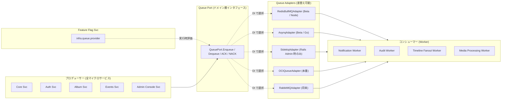

# キュー抽象化設計 (Queue Abstraction)

> **対象サービス**: 全マイクロサービス横断
> **作成日**: 2026-04-19
> **ステータス**: 承認待ち
> **関連レビュー**: Notion Design Docs（2026-04-18）「SQSを採用するようにしているが、Oracleや自前のバッジ処理などで利用する場合などを複数検討した上で、システムを提案するように」

---

## 1. 背景と目的

Recerdo の [基本的方針（ポリシー）](../core/policy.md) により、**AWS サービスは Cognito のみ利用し、SQS / SNS / SES などは使用しない**。メッセージングは以下のフェーズで **異なる基盤** を使う：

- **Closed Beta（セルフホスト）**: XServer VPS 上の **Redis + BullMQ（Node ワーカー） / asynq（Go ワーカー）** を第一選択
- **本番（OCI ファースト）**: **OCI Queue Service** を第一選択
- **将来**: 地域拡張時も OCI を軸に、必要に応じて RabbitMQ / NATS へ拡張（AWS SQS / GCP Pub/Sub は採用しない）

これらを **コード変更なし** で切り替え可能にするため、キュー層をアダプタパターンで抽象化する。

---

## 2. 評価対象の OSS / マネージド キュー

### 2.1 候補一覧と特性

| 候補 | 種別 | Recerdo 適性 | 推奨フェーズ |
|---|---|---|---|
| **Redis + BullMQ** ⭐ | セルフホスト（Node） | 軽量・運用容易・Bull Board ダッシュボード標準装備 | **Beta 第一推奨（Node ワーカー）** |
| **Redis + asynq** ⭐ | セルフホスト（Go）   | BullMQ の Go 版相当、asynqmon UI あり | **Beta 第一推奨（Go ワーカー）** |
| Redis + Sidekiq | セルフホスト（Ruby） | Rails Admin を採用した場合のみ候補 | Beta 代替（Rails 系のみ） |
| RabbitMQ | セルフホスト | AMQP 完備・複雑ルーティング可能 | 将来の中規模本番で検討 |
| NATS JetStream | セルフホスト | 軽量・高スループット・ストリーミング向け | 将来のイベント駆動拡張時 |
| Apache Kafka / Redpanda | セルフホスト | 大規模イベント・ログ処理 | 大規模本番（過剰気味） |
| **OCI Queue Service** ⭐ | マネージド | OCI ネイティブ・AMQP 1.0 互換・月 100 万 Request まで無料枠 | **本番 第一候補** |
| AWS SQS | マネージド | — | **不採用（ポリシー：AWS は Cognito のみ）** |
| GCP Pub/Sub | マネージド | 対象外（クラウド選定より） | — |

### 2.2 詳細比較

| 観点 | BullMQ (Redis) | asynq (Redis) | Sidekiq (Redis) | RabbitMQ | NATS JetStream | OCI Queue |
|---|---|---|---|---|---|---|
| ランタイム | Node.js | Go | Ruby | Erlang | Go | マネージド |
| プロトコル | Redis | Redis | Redis | AMQP 0-9-1 | NATS protocol | AMQP 1.0 |
| 保証 | At-least-once | At-least-once | At-least-once | At-least-once / exactly-once | At-least-once | At-least-once |
| DLQ | ✅ 内蔵 | ✅ (archived) | ✅ 内蔵 | ✅ | ✅ | ✅ |
| 遅延実行 | ✅ 秒精度 | ✅ 秒精度 | ✅ 分精度 | ✅ プラグイン | ✅ | ✅ |
| レート制限 | ✅ | ✅ | ❌ 自前 | ❌ | ❌ | ❌ |
| 優先度 | ✅ | ✅ | ✅ Pro のみ | ✅ | ❌ | ❌ |
| ダッシュボード | Bull Board | asynqmon | Sidekiq Web | RabbitMQ Management | NATS Dashboard | OCI Console |
| 最小運用コスト | Redis 共用（XServer VPS 内） | Redis 共用（同左） | Redis 共用（同左） | 別サーバ必要 | 別サーバ必要 | 無料枠 100万 req/月 |
| 学習曲線 | 低 | 低 | 低 | 中 | 中 | 低 |

### 2.3 Beta フェーズ推奨：Redis + BullMQ

**理由**:
- 既存 VPS 内の Redis を共用できる（追加リソース不要）
- ダッシュボード（Bull Board / BullMQ UI）が標準提供され、**管理者コンソールへの組み込みが容易**
- 遅延実行・レート制限・リトライ戦略を柔軟に設定可能（リマインダー通知・Timeline 非同期処理に最適）
- Sidekiq との選択は **Admin Console を Rails で作るか Next.js で作るか** に連動（[Admin Console 設計](admin-console-svc.md) 参照）

!!! note "Sidekiq を選ぶケース"
    Admin Console を **Rails（ActiveAdmin / Avo）** で構築する方針に倒した場合、Sidekiq + good_job を採用し、Rails 側の Worker を活用する選択肢もある。この場合も本ドキュメントのアダプタ抽象化は変わらない。

### 2.4 本番フェーズ推奨：OCI Queue Service

**理由**:
- OCI ファースト戦略と整合（クロスクラウドコスト最小化）
- AMQP 1.0 互換のため、RabbitMQ ライブラリ資産を流用可能
- マネージドのためシステム運用・スケーリングをオフロード
- 月 100万リクエストまで無料枠あり

フォールバック先として **RabbitMQ**（OCI Container Instances 上で自己ホスト）も同じ Port 実装で選択可能。**AWS SQS は [基本的方針](../core/policy.md) により採用しない**。

---

## 3. アーキテクチャ設計

### 3.1 全体構成



### 3.2 キュー命名規約（Topic / Stream）

すべてのアダプタで共通に以下の命名規則を使う。アダプタ内でそれぞれのプラットフォームにマッピング。

| 論理名 | 用途 | 推定処理量（Beta） | Retention |
|---|---|---|---|
| `audit.events` | 監査ログ受信 | 1K events/日 | 7日 |
| `notification.push` | FCM プッシュ配信 | 5K msg/日 | 1日 |
| `notification.email` | Postfix SMTP（CoreServerV2）メール配信 | 500 msg/日 | 1日 |
| `timeline.fanout` | Timeline 投稿ファンアウト | 1K events/日 | 1日 |
| `media.transcode` | 画像/動画変換 | 100 jobs/日 | 3日 |
| `auth.token.revoke` | トークン失効通知 | 50 msg/日 | 1日 |
| `admin.command` | 管理者コマンド非同期実行 | 20 msg/日 | 30日 |

### 3.3 Port 定義

```go
// domain/port/queue.go
package port

import "context"

type Job struct {
    ID          string                 // UUID v7
    Topic       string                 // 論理トピック名（例: "audit.events"）
    Payload     []byte                 // JSON エンコード済みペイロード
    Priority    int                    // 0(高) 〜 9(低)、サポートしないアダプタは無視
    DelaySec    int                    // 実行遅延（秒）
    Attempt     int                    // 試行回数
    MaxAttempts int                    // 最大試行回数
    Headers     map[string]string      // トレーシング等のメタデータ
    EnqueuedAt  time.Time
}

type QueuePort interface {
    Enqueue(ctx context.Context, job Job) error
    // Dequeue は1件ブロッキング取得。キャンセルは ctx で。
    Dequeue(ctx context.Context, topic string) (*Job, AckFn, error)
    HealthCheck(ctx context.Context) error
}

type AckFn func(result AckResult) error

type AckResult struct {
    Status AckStatus // SUCCESS | RETRY | DEAD
    Error  error
}
```

### 3.4 実装上のガイドライン

- **冪等性**: `Job.ID` を利用者側で採番し、Worker は Idempotency Key として扱う
- **再試行**: アダプタ内で指数バックオフ（1s → 2s → 4s → ...、最大 5 分）
- **DLQ**: `MaxAttempts` 超過時は `*.dead` サフィックス付きトピックへ移送
- **トレーシング**: `Headers["traceparent"]` に W3C Trace Context を埋め込み（OpenTelemetry 準拠）

---

## 4. アダプタ別実装ノート

### 4.1 BullMQ Adapter（Beta 第一推奨）

- Redis 6.2+ を使用
- Queue 名は `recerdo:queue:<topic>`
- ダッシュボード: Bull Board を Admin Console Svc に組み込み（[Admin Console 設計](admin-console-svc.md)）
- リトライ: `backoff: { type: 'exponential', delay: 1000 }`
- DLQ: `failed` キューを `audit.events.dead` として扱う

```typescript
// adapter/queue/bullmq_adapter.ts
import { Queue } from 'bullmq';
const queue = new Queue('recerdo:queue:audit.events', { connection: redis });
await queue.add('audit', payload, { attempts: 5, backoff: { type: 'exponential', delay: 1000 } });
```

### 4.2 Sidekiq Adapter（Rails Admin 採用時の代替）

- Redis 共用
- ActiveJob 経由でドメインから呼び出し
- 優先度キュー: `critical` / `default` / `low`
- **メリット**: Rails 側の Sidekiq-Web ダッシュボードが標準提供される

### 4.3 OCI Queue Adapter（本番第一候補）

- AMQP 1.0 または OCI SDK を使用
- Queue ID は OCID（Oracle Cloud Identifier）で指定、論理名は環境変数 `QUEUE_OCI_MAP_*` で解決
- Visibility Timeout: 30 秒〜
- Batch 受信最大 32 件

### 4.4 asynq Adapter（Beta Go ワーカー第一推奨）

- Redis 共用（XServer VPS、`DB=1` を asynq 用に割当）
- Queue 名: `recerdo:asynq:<topic>`
- ダッシュボード: `asynqmon` を admin-console-svc に iframe 埋め込み
- リトライ: `asynq.MaxRetry(5)` + 指数バックオフ
- DLQ: `archived` キューを `<topic>.dead` として扱う

```go
// adapter/queue/asynq_adapter.go
import "github.com/hibiken/asynq"
client := asynq.NewClient(asynq.RedisClientOpt{Addr: redisAddr})
task := asynq.NewTask("audit.events", payload)
_, err := client.Enqueue(task, asynq.MaxRetry(5), asynq.Timeout(300*time.Second))
```

### 4.5 RabbitMQ Adapter（オンプレ移行先候補）

- Exchange: `recerdo.topic`（topic exchange）
- Routing Key: 論理トピック名
- DLQ: `x-dead-letter-exchange` で `recerdo.dlx` にルーティング
- 管理UI 内蔵（15672）、Admin Console から iframe 埋め込み可能

---

## 5. マイグレーションパス

### 5.1 BullMQ → OCI Queue（Beta → 本番）

**Phase 1（Dual-Write）**:
- `infra.queue.dualWrite=true` で両方に書き込む
- Workers は `infra.queue.readFrom=old` で BullMQ からのみ消費
- 両者でジョブ数が一致するか監視

**Phase 2（Read Switch）**:
- `infra.queue.readFrom=new` に切替 → OCI Queue の Worker が活性化
- BullMQ 側に残留ジョブがないことを確認

**Phase 3（Single-Write）**:
- `infra.queue.dualWrite=false` に戻し、OCI Queue のみ稼働
- BullMQ は冗長として 2 週間維持、問題なければ撤去

### 5.2 切替時のデータ喪失ゼロ戦略

- **In-flight ジョブ**: 切替直前に BullMQ の一時停止（`pause`）→ 完了待ち → 新系統解放
- **重複実行**: Worker 側が冪等性キーで排除
- **データ差分監視**: Prometheus + Grafana / OCI Monitoring で処理レート・失敗率を 1 分粒度で比較（AWS CloudWatch は不使用）

---

## 6. 観測可能性（Observability）

### 6.1 メトリクス（Prometheus Exposure）

| メトリクス | 説明 |
|---|---|
| `recerdo_queue_depth{topic}` | 現在のキュー滞留数 |
| `recerdo_queue_enqueued_total{topic,provider}` | 投入総数 |
| `recerdo_queue_dequeued_total{topic,provider,status}` | 処理総数 |
| `recerdo_queue_duration_seconds{topic}` | 滞留時間分布 |
| `recerdo_queue_dlq_total{topic}` | DLQ 送り数 |
| `recerdo_queue_adapter_errors_total{provider,error}` | アダプタ内部エラー |

### 6.2 アラート

- **P1**: `queue_dlq_total` が 5分で 10 件超過 → PagerDuty
- **P2**: `queue_depth` が 15 分で 1,000 超過 → Slack #alerts
- **P2**: `queue_duration_seconds{quantile=0.95}` が 1 分超過 → Slack

### 6.3 ログフォーマット

```json
{
  "ts": "2026-04-19T12:34:56Z",
  "level": "info",
  "svc": "notification-worker",
  "queue.provider": "bullmq",
  "queue.topic": "notification.push",
  "job.id": "01HMFG2...",
  "job.attempt": 2,
  "trace_id": "0af7651916cd43dd8448eb211c80319c",
  "event": "job.completed",
  "duration_ms": 342
}
```

---

## 7. セキュリティ

- **認可**: プロデューサ/コンシューマは **サービスアカウント** で認証、Topic 単位の ACL（書き/読み）を設定
- **暗号化**: 全アダプタで TLS 必須、ペイロードに PII が含まれる場合はアプリ層で追加暗号化
- **監査**: Queue 操作は **Audit Svc へサンプリング 10%** で送信、Kill Switch 操作は 100%

---

## 8. 参考文献

- [BullMQ Documentation](https://docs.bullmq.io/)
- [Sidekiq Documentation](https://sidekiq.org/)
- [OCI Queue Service](https://docs.oracle.com/en-us/iaas/Content/queue/home.htm)
- [hibiken/asynq — Simple, reliable, and efficient distributed task queue in Go](https://github.com/hibiken/asynq)
- [CloudEvents Specification](https://cloudevents.io/)
- [omniqueue-rs — Abstraction Layer Reference Implementation](https://github.com/svix/omniqueue-rs)
- [When Services Need to Talk: Kafka vs RabbitMQ vs BullMQ](https://www.hkinfosoft.com/when-services-need-to-talk-choosing-between-kafka-rabbitmq-and-bullmq/)

---

## 9. 関連ドキュメント

- [デプロイメント戦略](../core/deployment-strategy.md)
- [環境抽象化 & Feature Flag](../core/environment-abstraction.md)
- [Admin Console Svc（MS）](admin-console-svc.md)
- [Feature Flag 管理システム（MS）](feature-flag-system.md)

---

最終更新: 2026-04-19 ポリシー適用
